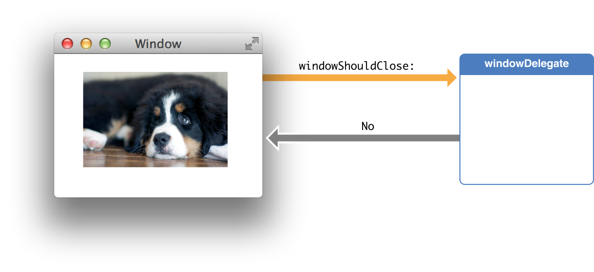

# Delegation

(Translated [Apple Document - Delegation](https://developer.apple.com/library/content/documentation/General/Conceptual/DevPedia-CocoaCore/Delegation.html))

Delegation is a simple and powerful pattern in which one object in a program acts on behalf of, or in coordination with, another object. The delegating object keeps a reference to the other object—the delegate—and at the appropriate time sends a message to it. The message informs the delegate of an event that the delegating object is about to handle or has just handled. The delegate may respond to the message by updating the appearance or state of itself or other objects in the application, and in some cases it can return a value that affects how an impending event is handled. The main value of delegation is that it allows you to easily customize the behavior of several objects in one central object.

Delegation은 프로그램 안의 한 오브젝트가 다른 오브젝트를 대신해서 혹은 협조해서 행동하게 하는, 간단하고 강력한 패턴입니다. Delegate를 선언한 객체는 Delegate가 된 객체를 소유(참조를 유지)하며 적절한 시간에 해당 객체에 메시지(메서드 호출)를 보냅니다. 이 메시지는 Delegate를 선언한 객체가 처리하려고 하거나 처리중인 이벤트를 Delegate 객체에게 알립니다. Delegate 객체는 이에 응답하여 응용 프로그램의 UI나 상태 또는 다른 객체를 업데이트합니다. 경우에 따라 임박한 이벤트가 처리되는 방식에 영향을 주는 값을 반환할 수 있습니다. Delegation의 주된 가치는 하나의 중앙 객체에서 여러 객체의 동작을 쉽게 변경할 수 있다는 것입니다.

### Delegation and the Cocoa Frameworks
### 코코아 프레임워크와 Delegation

The delegating object is typically a framework object, and the delegate is typically a custom controller object. In a managed memory environment, the delegating object maintains a weak reference to its delegate; in a garbage-collected environment, the receiver maintains a strong reference to its delegate. Examples of delegation abound in the Foundation, UIKit, AppKit, and other Cocoa and Cocoa Touch frameworks.

Delegate를 선언한 객체는 일반적으로 프레임워크에 포함된 객체이며, Delegate가 되는 객체는 일반적으로 사용자가 정의한 컨트롤러 객체입니다. 메모리 관리 환경에서 Delegate를 선언한 객체는 해당 Delegate가 된 객체에 대한 약한(weak) 참조를 유지 관리합니다. 가비지 수집 환경에서 Delegate를 선언한 객체는 Delegate가 된 객체에 대한 강력한 참조를 유지 관리합니다. Delegation은 Foundation, UIKit, AppKit 및 기타 Cocoa 및 Cocoa Touch 프레임 워크 전체에서 아주 풍부하게 사용되고 있습니다.

An example of a delegating object is an instance of the NSWindow class of the AppKit framework. NSWindow declares a protocol, among whose methods is windowShouldClose:. When a user clicks the close box in a window, the window object sends windowShouldClose: to its delegate to ask it to confirm the closure of the window. The delegate returns a Boolean value, thereby controlling the behavior of the window object.

Delegate를 선언한 객체의 예로 NSWindowAppKit 프레임 워크 클래스의 인스턴스가 있습니다. NSWindow가 선언한 프로토콜 안에는 windowShouldClose: 라는 메서드가 있습니다. 사용자가 창에서 닫기 상자를 클릭하면 창 객체가 windowShouldClose: 를 Delegate가 된 객체에게 보내 창 닫기를 확인하도록 요청합니다. Delegate가 된 객체는 bool값을 반환하여 창 객체를 컨트롤할 수 있습니다.

### Delegation and Notifications

The delegate of most Cocoa framework classes is automatically registered as an observer of notifications posted by the delegating object. The delegate need only implement a notification method declared by the framework class to receive a particular notification message. Following the example above, a window object posts an NSWindowWillCloseNotification to observers but sends a windowShouldClose: message to its delegate.

대부분의 Cocoa 프레임 워크 클래스의 델리게이트는 Delegate를 선언한 객체가 게시 한 통지의 옵저버로 자동 등록됩니다. 델리게이트는 특정 알림 메시지를 받기 위해 프레임 워크 클래스에 의해 선언 된 알림 메서드 만 구현하면됩니다. 위의 예제에 따라, 윈도우 객체는 NSWindowWillCloseNotification을 보내는 것 이외에도, windowShouldClose: 메시지를 Delegate 객체에게 보냅니다.

### Data Source

A data source is almost identical to a delegate. The difference is in the relationship with the delegating object. Instead of being delegated control of the user interface, a data source is delegated control of data. The delegating object, typically a view object such as a table view, holds a reference to its data source and occasionally asks it for the data it should display. A data source, like a delegate, must adopt a protocol and implement at minimum the required methods of that protocol. Data sources are responsible for managing the memory of the model objects they give to the delegating view.

데이터 소스는 델리게이트와 거의 동일합니다. 차이점은 위임 대상과의 관계에 있습니다. 데이터 소스는 사용자 인터페이스 제어 대신 데이터 제어를 위임받습니다. Delegate를 선언한 객체 (일반적으로 테이블 뷰와 같은 뷰 객체)는 해당 데이터 소스에 대한 참조를 보유하고 표시해야하는 데이터를 묻는 경우가 있습니다. 델리게이트와 같은 데이터 소스는 프로토콜을 채택하고 최소한 해당 프로토콜의 필수 메소드를 구현해야합니다. 데이터 소스는 위임 뷰에 제공 한 모델 객체의 메모리를 관리합니다.