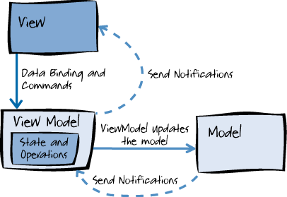

# MVVM
## MVVM이란?
- Microsoft .NET Framework 3.0에서 구현된 WPF와 Sliverlight를 모두 지원하기 위해 고안됨..........

- Model, View, ViewModel을 말함
- MVC 패턴의 변형으로 뷰의 추상화를 만드는것이 핵심
- 뷰의 추상화는 reusable, testable 함
- 이를 통해 구조는 단순해짐

## 설명

출처 : MSDN

- Model은 ViewModel에 notification을 전달
- ViewModel은 View에 notification을 전달
- View는 ViewModel에 명령을 전달
- ViewModel은 Model을 업데이트
- ViewModeldms View에서 명령을 Input으로 받고
- View에 전달할 notification을 Output으로 내보낼수 있음
- 따라서 ViewModel은 Input과 Output을 가짐

출처: https://goo.gl/QFV6Mq

- iOS에서의 MVVM은 MVC와 큰 차이는 없음

- MVVM의 주요 특징은 다음과 같음
  - Controller는 더이상 Model에게 말을 걸수 없고 ViewModel을 통해야함
  - Model과 ViewModel이 하나의 짝을 이루고, View와 Controller가 짝을 이루는 구조
  - ViewModel은 Presentation Logic을 다루게되지만 UI를 다루지는 않음
  - MVVM구조에서 ViewModel을 Protocol로 구성하면 코드가 더욱더 간결해짐. 이는 애플이 UITableView를 구성할 때 Delegate와 DataSource를 Protocol로 선언한 것과 같은 패턴임
  - 데이터 바인딩은 필수임.
