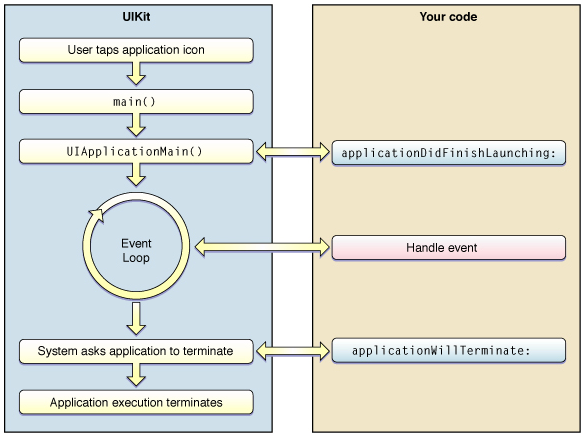
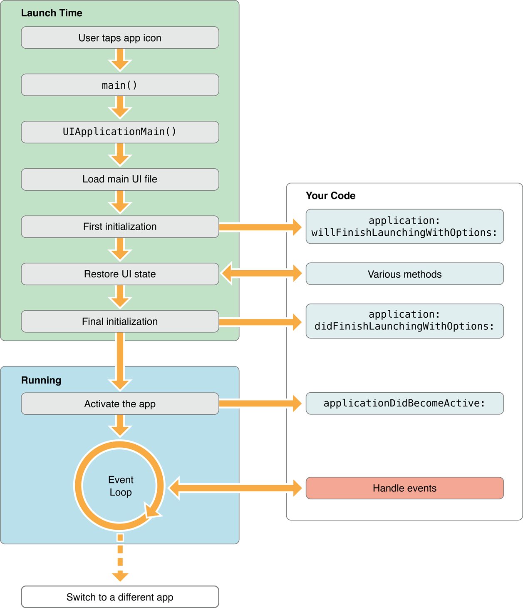
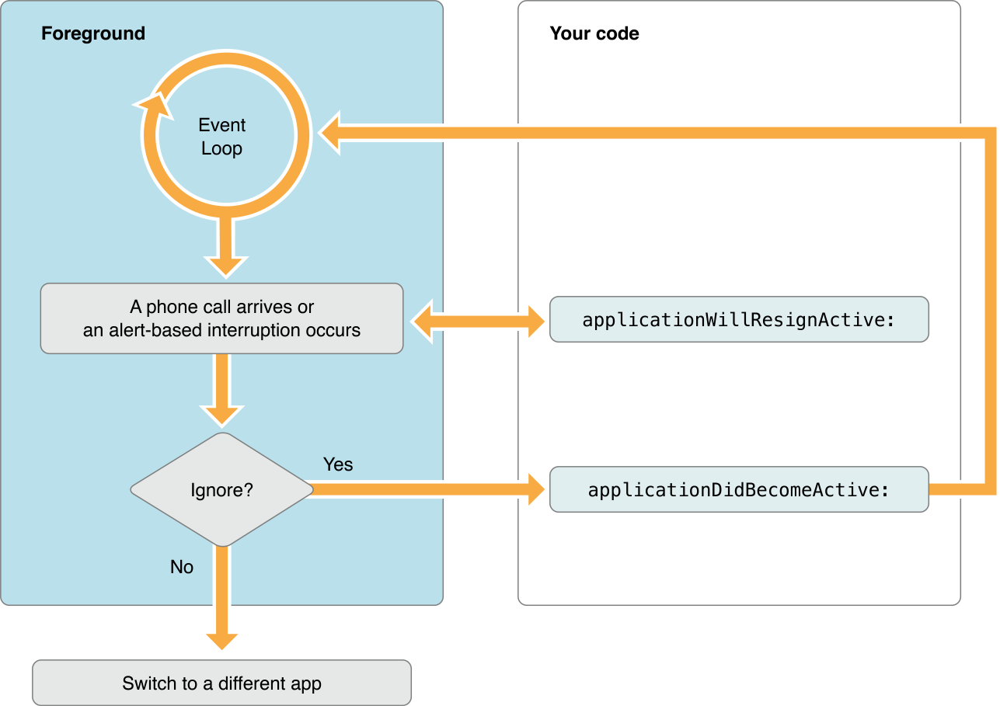
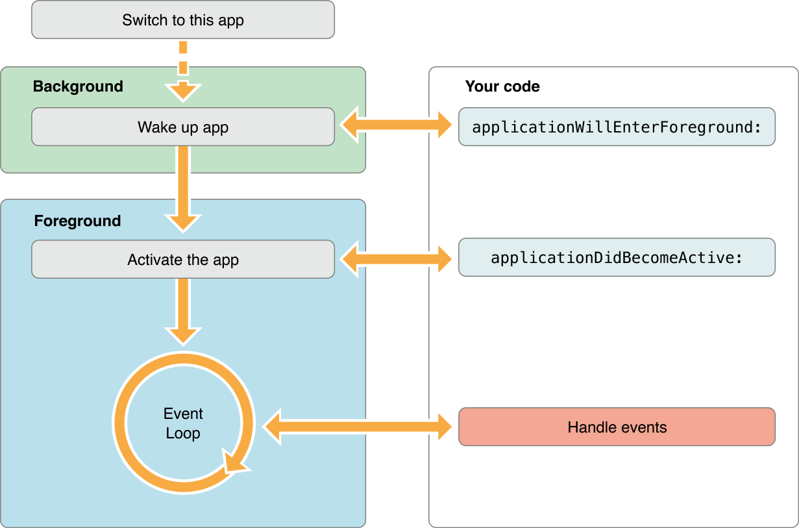
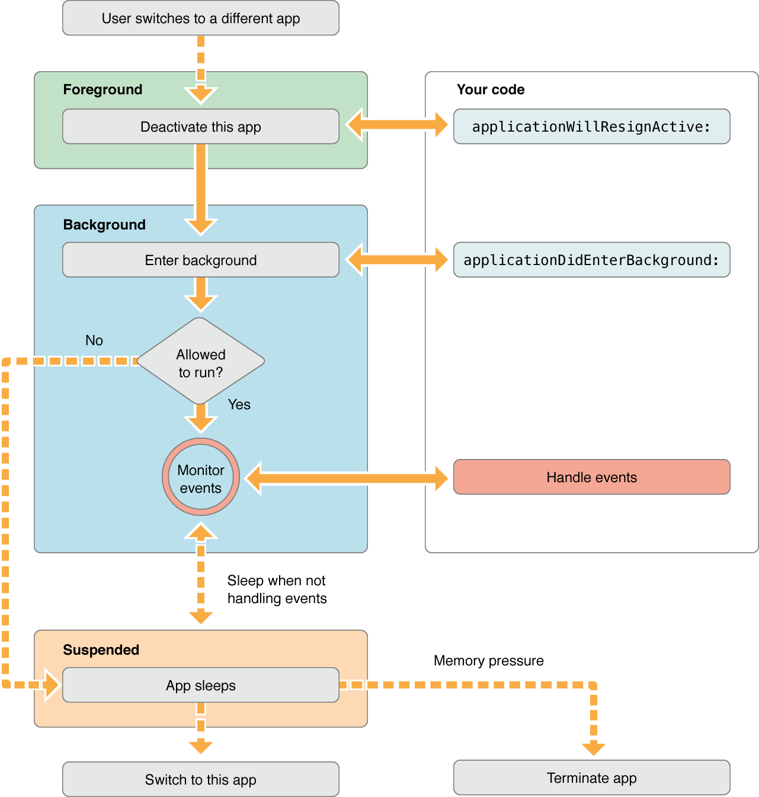

# Ch.13 iOS앱의 구조와 코코아 터치 프레임워크
- 앱은 기본적으로 시스템 프레임워크에 정의된 원리에 따라 동작하지만, 이 영역을 제외한 나머지 범위에서는 커스텀 코드를 통해 원하는 기능과 유저 인터페이스를 구현할수 있음

## 13.1앱의 기본 구조
### 13.1.1 엔트리 포인트와 앱의 초기화 과정
- Objective-C 도 C를 기반으로 하고 있기 때문에 이를 이용하여 만들어진 iOS앱도 main()함수로부터 시작됨
- main()함수가 하는일은 실행시 시스템으로부터 전달받은 두 개의 인자값과 AppDelegate클래스를 이용하여 UIApplicationMain()함수를 호출하고 그결과로 UIApplication 객체를 반환
- 생성된 UIApplication 객체는 UIKit 프레임 워크에 속해있으므로 이후의 앱 제어권은 UIKit 프레임워크로 이관됨
- UIApplicationMain()함수는 iOS앱에 속하는 부분의 엔트리포인트라고 할수 있음
- 이 함수는 앱의 핵심객체를 생성하는 프로세스를 핸들링하고, 스토리보드 파일로부터 앱의 유저 인터페이스를 읽어들일뿐만 아니라 내가 작성한 커스텀 코드를 호출해줌으로써 앱 생성 초기에 필요한 설정을 구현할 수 있게 해줌, 또한 이벤트를 입력받기 위한 이벤트 루프를 실행시키키도 함
- UIApplicationMain()함수가 생성하는 UIApplication은 앱의 본체라고 할 수 있는 객체로 사실상 앱 그 자체를 의미함.
- UIApplication 객체는 AppDelegate라는 대리 객체를 내세우고 커스텀 코드를 처리할 수 있도록 약간의 권한을 부여함
- AppDelegate는 UIApplication으로부터 위임받은 일부 권한을 이용하여 커스텀 코드와 상호 작용을 하는 역할을 담당하고, 이를 통해 우리가 필요한 코드를 구현할 수 있도록 도와줌
- AppDelegate객체는 iOS 애플리케이션 내에서 오직 하나의 인스턴스만 생성되도록 시스템 적으로 보장을 받음
	- 앱이 처음 만들어 질때 객체가 생성되고 앱이 실행되는 동안 계속 유지되다가 앱이 종료되면 그때 함께 소멸하는 등 앱 전체의 생명주기와 함께 함

- Swift에서는 직접 UIApplicationMain()을 호출하여 delegate 클래스를 인자값으로 전달할 수 없으므로 대신 앱 델리게이트 역할을 할 클래스에 @UIApplicationMain 어노테이션을 걸어 표시하는 방식으로 시스템에 델리게이트 클래스 정보를 전달함.




- Swift에서는 Main()함수를 통해 UIApplicationMain()을 호출하는 대신 @UIApplicationMain어노테이션을 찾아 해당 클래스를 실행
- application(_:didFiniShingLaunchingWithOptions:)메소드에 원하는 커스텀 코드를 작성해 두면 앱이 처음 시작될때 해당 코드를 실행할 수 있음
- 이벤트 루프가 실행되면서 내가 작성한 이벤트 핸들에 의해 커스텀 코드로 연결됨(핸들은 @IBAction등등)
- 앱이 실행목적 완료하고 더이상 사용되지 않으면 시스템은 앱을 메모리에서 제거하기 위한 준비를 함
- 이 과정에서 앱 시스템은 델리게이트 클래스applicationWillTerminate(_:)메소드를 호출, 앱 종료시 처리해야할 내용이 있다면 이 메소드 내부에 커스텀 코드로 작성해 두기만 하면 됨


#### 자세한 그림 참고
#### *Launching an app into the foreground

#### *Launching an app into the background

#### *Handling alert-based interruptions

#### *Transitioning from the background to the foreground

#### *Moving from the foreground to the background



#### <[애플공식문서 참고링크] (https://goo.gl/4eEd4U)>

### 13.1.2 MVC패턴
- iOS 앱의 객체 관계는 MVC패턴에 기반하고 있음
- 모델(Model) - 데이터를 담당
- 뷰(View) - 데이터에 대한 화면 표현을 담당
- 컨트롤러(Controller) - 모델과 뷰 사이에 위치하여 데이터를 가공하여 뷰로 전달하고 뷰에서 발생하는 이벤트를 입력받아 처리하는 역할을 담당


- 각각의 역할로 쪼개고 나누어 놓은 이유는 많은 장점을 가지기 때문
- 가장 큰 장점은 앱에서 사용되는 데이터와 비즈니스 로직을 데이터에 대한 시작적인 표현으로부터 분리해 줌으로써 화면을 신경쓰지 않고도 데이터나 비즈니스 로직을 작성할 수 있다는 점
- 
### 13.1.3 앱의 상태 변화
- 앱의 상태변화는 운영체제가 처리하는 영역
- iOS에서 앱이 가질수 있는 상태값은 다음과 같음

```
- Not Running : 앱이 시작되지 않았거나 실행되었지만 시스템에 의해 종료된 상태를 나타냄
- Inactive : 앱이 전면에서 실행중이지만, 아무런 이벤트를 받지 않고 있는 상태를 나타냄
- Active : 앱이 전면에서 실행중이며, 이벤트를 받고 있는 상태를 나타냄
- Background : 앱이 백그라운드에 있지만 여전히 코드가 실행되고 있는 상태를 나타냄
- Suspended : 앱이 메모리에 유지되지만 실행되는 코드가 없는 상태
```


- 앱의 상태가 변화할 때마다 앱 객체는 앱 델리게이트에 정의된 특정 메소드를 호출
- 주요 메소드는 다음과 같음

```
application(_:willFinishLaunchingWithOptions:)
	- 앱이 구동되어 필요한 초기실행과정이 완료되기 직전에 호출되는 메소드
application(_:didFinishLaunchingWithOptions:)
	- 앱이 사용자에게 화면으로 표시되기 직전에 호출되는 메소드
applicationDidBecomeActive(_:)
	- 실행된 앱이 포그라운드, 즉 화면 전면에 표시될때 호출되는 메소드
applicationDidEnterBackground(_:)
	- 앱이 백그라운드 상태에 진입했을때 호출
applicationWillTermainate(_:)
	- 앱이 종료되기 직전에 호출되는 메소드
```
#### [UIAppdelegateProtocol 공식문서 링크](https://goo.gl/mfZk74)
