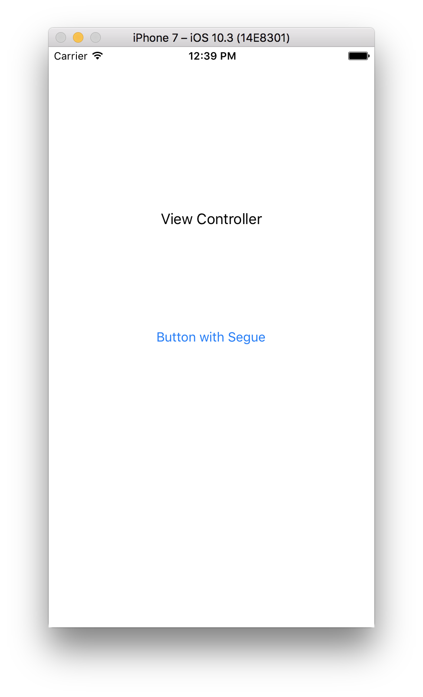
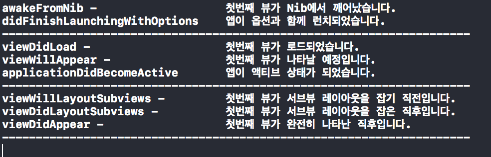
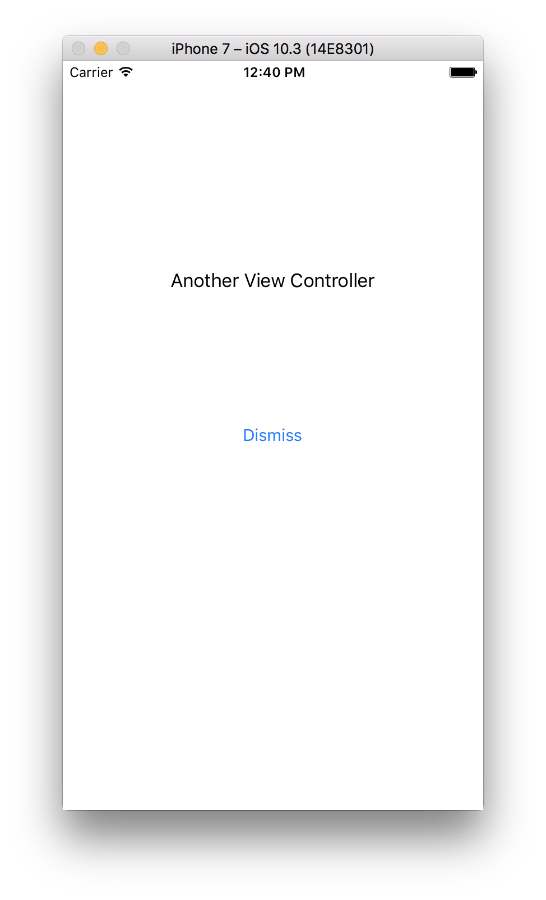
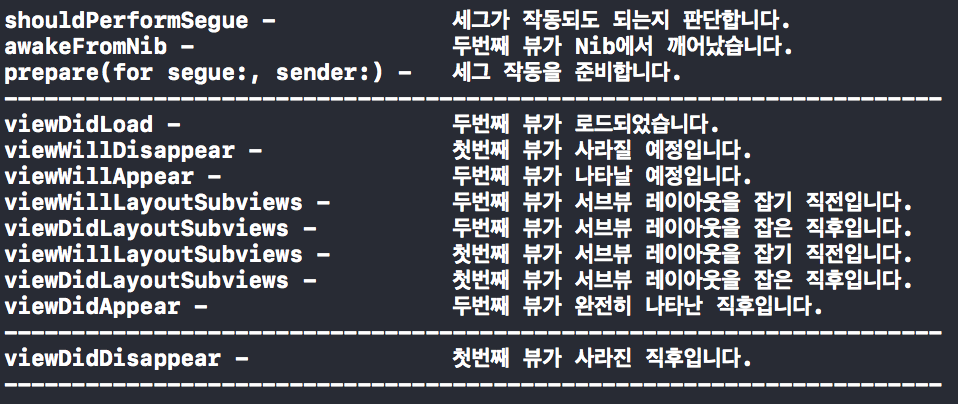
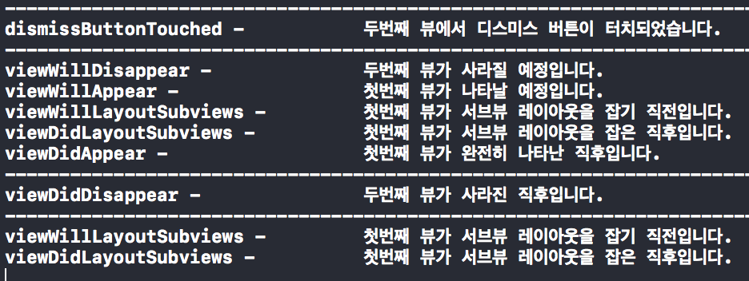

# Ch.13 iOS앱의 구조와 코코아 터치 프레임워크
## 13 앱의 기본 구조
### 13.1.1 엔트리 포인트와 앱의 초기화 과정

### 13.1.2 MVC패턴
* 모델(Model) - 데이터를 담당
* 뷰(View) - 데이터에 대한 화면 표현을 담당
* 컨트롤러(Controller) - 모델과 뷰 사이에 위치하여 데이터를 가공하여 뷰로 전달하고 뷰에서 발생하는 이벤트를 입력받아 처리하는 역할을 담당

### 13.1.3 앱의 상태 변화

```
- Not Running : 앱이 시작되지 않았거나 실행되었지만 시스템에 의해 종료된 상태를 나타냄
- Inactive : 앱이 전면에서 실행중이지만, 아무런 이벤트를 받지 않고 있는 상태를 나타냄
- Active : 앱이 전면에서 실행중이며, 이벤트를 받고 있는 상태를 나타냄
- Background : 앱이 백그라운드에 있지만 여전히 코드가 실행되고 있는 상태를 나타냄
- Suspended : 앱이 메모리에 유지되지만 실행되는 코드가 없는 상태
```

* 앱의 상태가 변화할 때마다 앱 객체는 앱 델리게이트에 정의된 특정 메소드를 호출

```
application(_:willFinishLaunchingWithOptions:)
	- 앱이 구동되어 필요한 초기실행과정이 완료되기 직전에 호출되는 메소드
application(_:didFinishLaunchingWithOptions:)
	- 앱이 사용자에게 화면으로 표시되기 직전에 호출되는 메소드
applicationDidBecomeActive(_:)
	- 실행된 앱이 포그라운드, 즉 화면 전면에 표시될때 호출되는 메소드
applicationDidEnterBackground(_:)
	- 앱이 백그라운드 상태에 진입했을때 호출
applicationWillTermainate(_:)
	- 앱이 종료되기 직전에 호출되는 메소드
```

## 13.2 iOS와 코코아 터치 프레임 워크
### 13.2.1 iOS
### 13.2.2 코코아 터치 프레임워크

## 13.3 앱을 구성하는 핵심 객체들
### 13.3.1 iOS 유저 인터페이스의 표현구조
* 윈도우는 iOS에서 디바이스의 스크린을 빈틈없이 채우기 위한 객체로, 항상 유저 인터페이스 표현 계층의 최상위에 위치
* 뷰는 콘텐츠를 담아 이를 스크린상에 표시하고 사용자의 입력에 반응
* 윈도우 객체는 항상 루트 뷰 컨트롤러만을 참조
* 컨텐츠 뷰 컨트롤러 : 씬을 담당하고 콘텐츠를 표시하는 컨트롤러
* 컨테이너 뷰 컨트롤러 : 콘텐츠를 배치하는 대신 다른 뷰 컨트롤러를 배치하고, 이들을 서로 유기적인 관계로 엮이도록 만들어줌

### 13.3.2 뷰 컨트롤러
* 뷰 컨트롤러는 앱의 근간을 이루는 객체로 모든 앱은 최소한 하나 이상의 뷰 컨트롤러로 구성
* View Controller : iOS 에서 가장 기본이 되는 컨트롤러로서 앱의 데이터와 표시될 외형을 연결해서 하나의 동적인 화면을 만들어 내는 컨트롤러. 내부에 뷰를 포함하고 있음 (UIKit프레임워크의 클래스는 UIViewController)
* Navigation Controller : 앱의 화면 이동에 관한 관리와 그에 연관된 처리를 담당해주는 컨트롤러, 뷰를 포함하고 있지 않으므로 다른 컨트롤러와 결합하여 부분적으로 화면을 구성 (UIKit프레임워크의 클래스는 UINavigationController)
* Table View Controller : 내부에 리스트 형식의 테이블 뷰를 포함하고 있어 여러 항목이나 데이터를 화면에 나열하기 위한 목적으로 사용되는 컨트롤러 (UIKit프레임워크의 클래스는 UITableViewController)
* Tab Bar Controller : 화면을 나타내는 여러개의 탭이 있고 탭을 터치하면 화면이 전환되는 형태의 앱을 만들고자 할 때 사용되는 컨트롤러 (UIKit프레임워크의 클래스는 UITabbarController)
* Split View Controller : (UIKit프레임워크의 클래스는 UISplitViewController)

### 13.3.3 뷰컨트롤러의 상태변화와 생명주기
* 뷰컨트롤러의 생명 주기는 장면(Scene)의 전환과 복귀에 밀접하게 연관되어 있음
* 뷰 컨트롤러는 다음과 같이 네가지 상태로 나눌수 있음

```
	- Appearing : 뷰 컨트롤러가 스크린에 등장하기 시작한 순간부터 등장을 완료하기 직전까지의 상태
	- Appeared : 뷰 컨트롤러가 스크린 전체에 완전히 등장한 상태
	- Disappearing : 뷰 컨트롤러가 스크린에서 가려지기 시작해서 완전히 가려지기 직전까지의 상태
	- Disappeared : 뷰 컨트롤러가 스크린에서 완전히 가려졌거나 혹은 퇴장한 상태
```

* 화면이 처음 실행되거나 또는 퇴장한 상태에서 다시 등장하기 시작하는 상태(Appearing)로 바뀌는 동안 뷰 컨트롤러는 앱 객체에 의해 viewWillAppear(_:)메소드가 호출
* 화면이 등장하기 시작한 단계를 넘어서 완전히 등장하고 나면 viewDidAppear(_:) 메소드가 호출
* 이 상태에서 다른 액션이 일어나 화면의 전환이 이루어지거나 홈 버튼을 눌러 앱이 백그라운드로 내려가는등 스크린에서 화면이 퇴장하는 상태 변화가 발생하면 그 즉시 viewWillDisappear(_:) 메소드가 호출
* 상태 변화가 완료 되었을때 viewDidDisappear(_:)메소드가 호출

# Life Cycle








