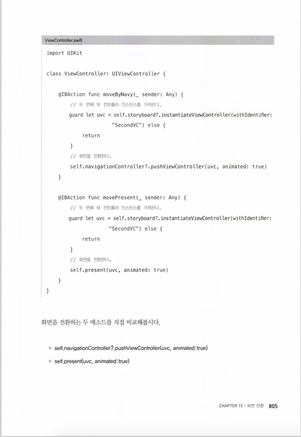
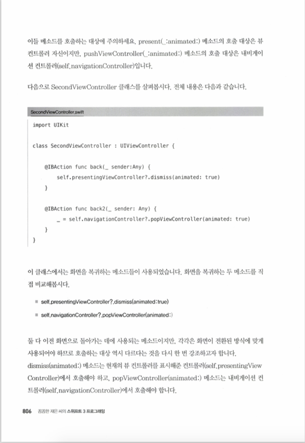
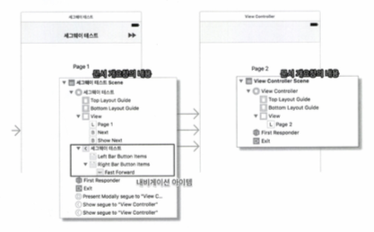

# Ch.15 화면전환
* iOS에서 화면을 전환하는 방법에는 크게 두가지가 있음
* 하나는 소스 코드를 통해 전환하는 방식이고 (동적으로 화면전환)
* 또 다른 하나는 스토리보드가 제공하는 기능을 이용하여 전환하는 방식(정적으로 화면전환)
* 동적인 방식은 특정 상황에 대응할 수 있지만 조금 복잡하고 어려움
* 정적인 방식은 일괄적으로 적용되는 것이라 특정 상황에 대응하기 어렵지만 그만큼 구현하기 쉽다는 장점이 있음

## 15.1 iOS에서의 화면 전환 개념
* iOS에서 화면 전환 방식은 분류기준에 따라 크게 4가지로 나누어 볼 수 있음
```
1. 뷰 컨트롤러의 뷰 위에 다른 뷰를 가져와 바꿔치기 하기
2. 뷰 컨트롤러에서 다른 뷰 컨트롤러를 호출하여 화면 전환하기
3. 내비게이션 컨트롤러를 사용하여 화면 전환하기
4. 화면 전환용 객체 세그웨이를 사용하여 화면 전환하기
```

* 위 1은 특수한 상황에서 제한적으로 사용하는 방법임. 일부 뷰 컨트롤러들은 콘텐츠를 직접 배치하여 화면을 보여주는 역할 대신 다른 뷰 컨트롤러를 구조화 하는 역할을 하는데 이때 화면을 구조화하는 방식이 이것임
* 이같은 뷰 컨트롤러를 컨테이너 뷰 컨트롤러라고 함
* 1 을 제외한 나머지 대부분의 화면 전환은 모두 뷰 컨트롤러를 호출하는 방식으로 이루어짐. 전환할 화면을 담당하는 뷰 컨트롤러의 인스턴스를 생성하고, 이를 불러들여서 기존의 화면 위에 덮으면 화면이 전환된다는 뜻. 이에 따라 현재의 화면이 다른 화면으로 완전히 교체되는 것이 아니라 현재 화면이 있는 상태에서 그 위에 새로운 화면이 얹어지는 모양새가 됨
* 이같은 특성 때문에 기존 화면과 새로운 화면 사이에는 서로 참조 관계가 성립함. 화면이 전환되는 방식에 따라 이들은 서로 직접 참조할수 있거나 또는 화면전환을 관리하는 전담 객체를 통해 간접적으로 참조하기도 함
> iOS에서 화면 전환은 다음 두가지 특성을 가짐  
> 1. 다음 화면으로 이동하는 방법과 이전 화면으로 되돌아가는 방법이 다름  
> 2. 화면 전환방식에 따라 이전 화면으로 되돌아 가는 방법이 다름  

## 15.2 화면 전환 기법1 : 뷰를 이용한 화면 전환
* 하나의 뷰 컨트롤러 안에 두 개의 루트뷰를 준비한 다음 상태에 따라 뷰를 적절히 교체해 주는 것
* 이 방식은 하나의 뷰 컨트롤러가 두개의 루트뷰를 관리해야 하므로 그리 좋은 방법은 아님
* iOS에서는 하나의 뷰 컨트롤러 아래에 하나의 루트뷰를 관리하는 MVC패턴을 기본으로 하는데 위에방식은 이같은 구조를 완전히 거스르는 방식
* 또 다른 방식은 다른 뷰 컨트롤러에 올려진 루트 뷰를 가져와 표시하는 방식
* 이 방법 역시 뷰 컨트롤러 내부에 있어야 할 뷰가 다른 뷰 컨트롤러로 옮겨가 버리므로 뷰를 제어할 책임을 지는 컨트롤러가 모호해진다는 단점이 있음

## 15.3 화면 전환 기법2 : 뷰 컨트롤러 직접 호출에 의한 화면 전환
* 현재의 뷰 컨트롤러에서 이동할 대상 뷰 컨트롤러를 직접 호출해서 화면을 표시하는 방식
> present(<새로운 뷰 컨트롤러 인스턴스>, animated:<애니메이션 여부>)  
> present(_:animated:completion:)  
> completion -> 화면 전환이 완전히 끝난후에 호출해주는 역할  
* 프레젠테이션 방식으로 화면을 전환했을 때 iOS시스템은 화면에 표시된 뷰 컨트롤러(VC2)와 표시하고 있는 뷰 컨트롤러(VC1) 사이에 참조할 수 있는 포인터를 생성하여 서로 참조할 수 있게 해줌
* VC1은 presentedViewController 속성에다 자신이 표시하고 있는 새로운 뷰 컨트롤러의 포인터를 저장하고, 새로운 뷰 컨트롤러인 VC2에는 presentingViewController 속성에다 자신을 표시한 뷰 컨트롤러의 포인터를 저장
* VC1 에서는 presentViewController속성을 이용하여 VC2를 참조 할 수 있고 VC2에서는 presentingViewController속성을 이용하여 VC1을 참조할 수 있다는 뜻
* 이전 화면으로 복귀할 때는 다음과 같은 복귀 메소드를 사용함
> dismiss(animated:)  
* 이전 화면으로 돌아가는 기능이기 때문에 뷰 컨트롤러의 인스턴스를 인자값으로 받지는 않음. 화면 복귀시 애니메이션을 적용할지 말지를 결정하는 값만 전달해주면 됨
> dismiss(animated:completion:)  
> completion -> 화면 복귀가 완전히 처리되었을 때 실행할 구문을 인자값으로 입력받는 매개변수  
* 두 메소드는 기존화면이 새로운 화면 위로 올라오는 것이 아니라 기존 화면을 덮고 있던 새 화면을 걷어내는 것. 걷어낸 화면의 뷰 컨트롤러 객체는 운영체제에 의해 곧 메모리에서 해제됨
* iOS에서 화면이 사라지게 처리하는 것은 사라질 화면의 뷰 컨트롤러 자신이 아니라 자신을 띄우고 있는 이전 뷰 컨트롤러임
* 즉 VC1 이 VC2 를 호출하여 화면에 표시해주었다면 반대로 VC2를 화면에서 사라지게 하는것도 VC1
> self.presentingViewController?.dismiss(animated:)  

### 15.3.1 화면전환 실습

```
//
//  ViewController.swift
//  Scene-Trans01
//
//  Created by 이재성 on 2017. 6. 13..
//  Copyright © 2017년 jaeseong. All rights reserved.
//

import UIKit

class ViewController: UIViewController {
    @IBAction func moveNext(_ sender: Any) {
        
        // 여러개의 스토리 보드가 있을경우 이렇게 사용..Main은 스토리보드 파일명
        
        // let storyboard = UIStoryboard(name: "Main", bundle: Bundle.main)
        // let uvc = storyboard.instantiateViewController(withIdentifier: "SecondVC")
        
        
        // let uvc = storyboard!.instantiateViewController(withIdentifier: "SecondVC")
        // self.storyboard 값은 옵셔널 타입, 경우에 따라 nil값이 될수도 있음
        // 이값을 nil검사 없이 바로 ! 연산자를 사용하여 강제 해제하였으므로 만약 self.storyboard 값이 nil이라면 오류가 발생. 이를 옵셔널 체인과 옵셔널 바인딩으로 보강하면 다음과 같음
        
        /* if let uvc = storyboard?.instantiateViewController(withIdentifier: "SecondVC"){
                uvc.modalTransitionStyle = UIModalTransitionStyle.coverVertical
        
                self.present(uvc, animated: true)
            }
        */
        
        //뷰 컨트롤러 인스턴스는 moveNext메소드 전체 실행에서 비어있어서는 안되는 필수조건이기 때문에 guard 조건문으로 필터링
        //안전한 코드를 위해 self.storyboard를 옵셔널 체인으로 처리하여 instantiateViewController(withIdentifier:)메소드를 호출하여 뷰 컨트롤러의 인스턴스를 받아온 다음 옵셔널 타입을 해제하기 위해 상수 uvc에 옵셔널 바인딩, 만약 바인딩에 실패하면 메소드의 실행은 중지됨.
        guard let uvc = self.storyboard?.instantiateViewController(withIdentifier: "SecondVC") else {
            return
        }
        
        // 화면 전환할 때의 애니메이션 타입
        
        uvc.modalTransitionStyle = UIModalTransitionStyle.coverVertical
        
        // 인자값으로 뷰컨트롤러 인스턴스를 넣고 프레젠트 메소드 호출
        
        self.present(uvc, animated: true)
        
    }

    override func viewDidLoad() {
        super.viewDidLoad()
        // Do any additional setup after loading the view, typically from a nib.
    }

    override func didReceiveMemoryWarning() {
        super.didReceiveMemoryWarning()
        // Dispose of any resources that can be recreated.
    }
}
```                                                                                                                                                                                                                                                                                                                                                                                                                                                       

```
//
//  SecondViewController.swift
//  Scene-Trans01
//
//  Created by 이재성 on 2017. 6. 13..
//  Copyright © 2017년 jaeseong. All rights reserved.
//

import UIKit

class SecondViewController: UIViewController {

    //self.dismiss가 아님!!
	  //vc2(secondViewController를 사라지게 하는건 vc1 임

    @IBAction func dismiss(_ sender: Any) {
        self.presentingViewController?.dismiss(animated: true)
    }

    override func viewDidLoad() {
        super.viewDidLoad()

        // Do any additional setup after loading the view.
    }

    override func didReceiveMemoryWarning() {
        super.didReceiveMemoryWarning()
        // Dispose of any resources that can be recreated.
    }

}

```

## 15.4 네비게이션 컨트롤러를 이용한 화면 전환
* 네비게이션 컨트롤러는 뷰 컨트롤러의 특별한 종류로 계층적인 성격을 띠는 콘텐츠 구조를 관리하기 위한 컨트롤러(내비게이션 바가 내장되어 있음)
* 이 컨트롤러가 제어하는 모든 뷰 컨트롤러에 내비게이션 바를 생성하는 특징이 있음
* 루트뷰 컨트롤러는 내비게이션 컨트롤러에 직접 연결된 컨트롤러이므로 화면 UI상단에 내비게이션 바가 표시됨
* 내비게이션 컨트롤러는 화면에 현재 표시되고 있는 뷰 컨트롤러들을 내비게이션 스택을 이용하여 관리함
* 내비게이션 컨트롤러 최상위 뷰컨트롤러(마지막컨트롤러), 최하위 컨트롤러(루트뷰 컨트롤러)
* 최상위 뷰 컨트롤러에 추가할 때는 pushViewController(animated:) -> 새로운화면표시
* 최상위 뷰 컨트롤러에서 제거할 때는 popViewController(animated:) -> 이전화면으로 돌아올때
```
//
//  ViewController.swift
//  Scene-Trans02
//
//  Created by 이재성 on 2017. 6. 13..
//  Copyright © 2017년 jaeseong. All rights reserved.
//

import UIKit

class ViewController: UIViewController {

    override func viewDidLoad() {
        super.viewDidLoad()
        // Do any additional setup after loading the view, typically from a nib.
    }

    override func didReceiveMemoryWarning() {
        super.didReceiveMemoryWarning()
        // Dispose of any resources that can be recreated.
    }

    @IBAction func moveByNavi(_ sender: Any) {
        
        // 
        guard let uvc = self.storyboard?.instantiateViewController(withIdentifier: "SecondVc") else {
            return
        }
        self.navigationController?.pushViewController(uvc, animated: true)
    }
    @IBAction func movePresent(_ sender: Any) {
        guard let uvc = self.storyboard?.instantiateViewController(withIdentifier: "SecondVc") else {
            return
        }
        self.present(uvc, animated: true)
    }

}
```

```
//
//  SecondViewController.swift
//  Scene-Trans02
//
//  Created by 이재성 on 2017. 6. 13..
//  Copyright © 2017년 jaeseong. All rights reserved.
//

import UIKit

class SecondViewController: UIViewController {

    override func viewDidLoad() {
        super.viewDidLoad()

        // Do any additional setup after loading the view.
    }

    override func didReceiveMemoryWarning() {
        super.didReceiveMemoryWarning()
        // Dispose of any resources that can be recreated.
    }
    
    @IBAction func back(_ sender: Any) {
        self.presentingViewController?.dismiss(animated: true)
        
    }
    @IBAction func back2(_ sender: Any) {
        self.navigationController?.popViewController(animated: true)
    }
}
```




## 15.5 세그웨이를 이용한 화면 전환
* 세그웨이를 이용하면 뷰 컨트롤러에 대한 정보가 없어도 됨.
* 또한 뷰 컨트롤러의 객체를 생성할 필요도 없음. 세그웨이가 스토리보드상의 연결정보를 이용하여 대상 뷰 컨트롤러의 인스턴스를 자동으로 만들어줌
* 출발점이 뷰 컨트롤러 자체인 경우를 메뉴얼세그, 컨트롤이 출발점인 경우를 액션세그 또는 트리거세그라고 나누어 부르기도 함.
* 메뉴얼세그를 실행하려면 UIKit프레임워크에 정의된 performSegue(withIdentifier:sender:)메소드를 사용

### 15.5.1 액션 세그웨이
* 액션세그는 트리거와 세그웨이가 직접 연결된 것을 의미. 터치 또는 클릭 이벤트를 발생시켜 세그웨이를 실행할 수 있는 요소를 말함
* 액션세그는 화면 전환을 위해 프로그래밍 코드가 필요없고, 스토리보드에 구현된 객체를 트리거로 지정만 하면 되므로 전체적인 구성이 굉장히 단순해짐
* PresentModally 는 화면전환 메소드 중 present(_:animated:)메소드를 이용한 화면 전환과 같은 기능을 함
* 즉, 뷰 컨트롤러 자신이 새로운 화면을 불러들이도록 처리하는것
* 내비게이션 컨트롤러가 추가되어 있는 상태에서 Show 타입의 세그웨이를 생성하면 내비게이션 컨트롤러를 통한 화면 이동이 발생. 즉, 모든 화면 이동의 결과는 내비게이션 컨트롤러의 통제하에 있게됨. 따라서 모든 뷰 컨트롤러에는 내비게이션 바가 추가됨
* 내비게이션 컨트롤러가 없을 때는 세그웨이를 Show타입으로 생성하였더라도 PresentModally방식으로 실행됨
* 뷰컨트롤러에 임베디드 인 하여 네비게이션 컨트롤러 추가한후에 새로운  뷰 컨트롤러를 추가하고 세그웨이로 연결한 경우 내비게이션 아이템을 추가해야 타이틀 입력 또는 바버튼을 추가 할 수 있음.



### 15.5.2 메뉴얼 세그
* 메뉴얼세그는 해당 이벤트만 발생하면 자동적으로 실행되는 액션세그와 달리 뷰 컨트롤러와 뷰 컨트롤러 사이에 연결되는 수동 실행 세그웨이임.
* 액션세그는 트리거의 터치에 의해 실행되므로 별도의 처리코드가 전혀 필요없지만, 메뉴얼세그는 트리거 없이 수동으로 실행해야 하므로 소스 코드에서 세그웨이를 실행할 메소드를 호출해야함
> performSegue(withIdentifier :<세그웨이 식별자>, sender :<세그웨이 실행 객체>)  
* 두개의 인자값은 세그웨이가 여러 개일 경우를 대비한 세그웨이 식별자와 세그웨이를 실행하는 객체정보임. 
* 필요한 시점에서 세그웨이 식별자를 통해 특정 세그웨이를 지정하고 위 메소드를 호출하면 세그웨이가 실행되면서 화면이 전환되는 구조

### 15.5.3 Unwind - 화면 복귀
* 새로운 화면으로 전환하는 것은 Wind라고 한다면 Unwind는 wind작업을 해제 한다는 의미. 다시 말해 새로운 화면을 해제하고 본래의 화면으로 돌아간다는 해석이 됨
* 세그웨이는 목적지가 되는 뷰 컨트롤러의 인스턴스를 자동으로 생성. 따라서 두번째 뷰 컨트롤러에서 첫번째 뷰 컨트롤러로 세그웨이를 연결하면 자동으로 첫번째 뷰 컨트롤러의 인스턴스가 만들어짐. 하지만 이미 첫번째 뷰 컨트롤러의 인스턴스가 존재하는 상황
* 역방향 세그웨이를 다시 생성한다는 것은 이미 존재하는 뷰 컨트롤러의 인스턴스를 또다시 만들어 낸다는 의미.
* 뷰 컨트롤러의 인스턴스는 하나 이상 존재해서는 안됨
> 프레젠테이션 방식으로 이동했을 때 dismiss(animated:)  
> 내비게이션 컨트롤러를 이용하여 이동했을 때 popViewController(animated:)  
* 다른 방법은 세그웨이 레벨에서 제공하는 것으로 이른바 Unwind Segue를 이용
* 뷰 컨트롤러 도크바 Exit는 Unwind Segue를 구현할 수 있도록 지원함
* 버튼을 두번째 뷰 컨트롤러에 Present Modally로 연결 후 첫번째 뷰 컨트롤러 클래스에 다음과 같이 소스 코드 작성
* @IBAction func unwindToVC(_ segue : UIStoryboardSegue){
* 이경우 반드시 UIStoryboardSegue타입을 인자값으로 입력받도록 정의해야함
> Unwind Segue를 이용하여 한꺼번에 여러 페이지 복귀하기  
> 중간페이지로 돌아가기  
* 되돌아갈 화면의 뷰 컨트롤러 클래스에 UIStoryboardSegue 객체를 인자값으로 받는 메소드를 구현해두기만 하면 이를 시스템에서 Unwind 메소드로 인식함
* 따라서 Exit 아이콘에서 해당 메소드를 연결하는 것으로 Unwind Segue를 손쉽게 구현
* 이 때문에 호출될 메소드의 이름은 앱 프로젝트 영역에서 구분되는 이름이어야 하며, 각 뷰컨트롤러를 대표할 수 있는 이름으로 만드는 것이 좋음

### 15.5.4 커스텀 세그
* 지금까지 사용한 세그웨이 객체는 UIKit 프레임 워크에서 제공하는 UIStoryboardSegue 클래스를 통해 구현된 객체
* 앱 개발시 기본적인 기능의 세그웨이로는 원하는 기능을 구현하기 힘든 경우 발생
* 이럴때 대비하여 UIKit 프레임 워크는 UIStoryboardSegue 클래스를 서브 클래싱 하여 새로운 기능을 갖춘 세그웨이 객체를 정의 할 수 있도록 지원함
* 이를 커스텀 세그라고 부름
* UIStoryboardSegue를 상속받음
* 세그웨이 실행을 처리하는 메소드는 perform()이기 때문에 커스텀 세그에서 원하는 화면 전환기능을 구현하기 위해서는 이를 오버라이드해야함
```
class NewSegue : UIStoryboardSegue {
    
    override func perform() {
        //세그웨이 출발지 뷰 컨트롤러
        let srcUVC = self.source
        
        //세그웨이 도착지 뷰 컨트롤러
        let destUVC = self.destination
        
        UIView.transition(from: srcUVC.view, to: destUVC.view, duration: 2, options: .transitionCurlDown)
        
    }
}
```

### 15.5.5 전처리 메소드의 활용
* 세그웨이를 이용하여 화면을 전환하는 과정에서 뭔가 특별한 처리를 해 주어야 할 때에는 어떻게?
* 코코아 터치 프레임워크는 세그웨이가 실행되기 전에 특정한 메소드를 호출하도록 정해져 있기 때문에 이를 이용하면 화면을 전환하기 전에 필요한 처리를 해줄 수 있음
* 이를 전처리 메소드라고 함
* 세그웨이를 실행하기전에 값을 저장해둘 필요가 있거나 혹은 경고창을 띄워주는 등의 처리를 해야할 경우 전처리 메소드에 해당 내용을 작성해 놓으면 그 내용이 세그웨이가 실행되기 전에 자동으로 실행됨
> prepare(for segue : UIStoryboardSegue, sender : Any?) {...}  
* 주의!  이 메소드의 호출주체는 우리가 아니라 시스템이 호출하는 방식
* 우리가 호출하고 싶을때 임의로 호출하지 못함
* 일반적으로 뷰 컨트롤러에 연결된 세그웨이는 여러개가 될 수 있는데 이들 세그웨이는 모두 실행전에 전처리 메소드를 공통적으로 호출함
* 하나의 전처리 메소드를 여러 세그웨이가 공유하는 방식
* 이 때문에 전처리 메소드는 어느 세그웨이가 자신을 호출할 것인지를 알고 구분해 주어야할 필요가 있는데 그에 대한 정보가 첫번째 매개변수를 통해 전달
* 이 매개변수를 사용하여 어느 세그웨이가 실행되는 것인지 알 수 있으므로 이를 이용하여 세그웨이에 따른 조건별 작업을 처리하면 됨 (segue.identifier)
* 전처리 메소드의 두번째 매개변수는 세그웨이를 실행하는 트리거에 대한 정보
* 하나의 세그웨이는 여러개의 트리거를 가질수 있음. 화면 내에 있는 여러요소가 동일한 세그웨이를 실행할 수 있다는 뜻
* 만약 액션세그라면 버튼이나 테이블셀 혹은 제스쳐등의 객체가 주 대상이 되고
* 메뉴얼세그라면 뷰 컨트롤러 자신이 인자값으로 전달될것임

```
class ViewController: UIViewController {

    override func viewDidLoad() {
        super.viewDidLoad()
        // Do any additional setup after loading the view, typically from a nib.
    }

    override func didReceiveMemoryWarning() {
        super.didReceiveMemoryWarning()
        // Dispose of any resources that can be recreated.
    }

    override func prepare(for segue: UIStoryboardSegue, sender: Any?) {
        if (segue.identifier == "custom_segue") {
            NSLog("커스텀세그 실행")
        }else if (segue.identifier == "action_segue"){
            NSLog("액션세그 실행")
        }else {
            NSLog("알수없는 세그 실행")
        }
        
    }
}
```

      
