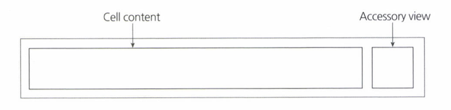
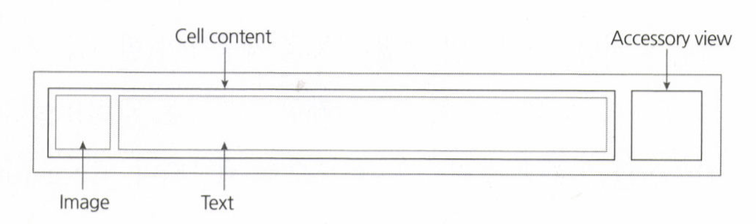
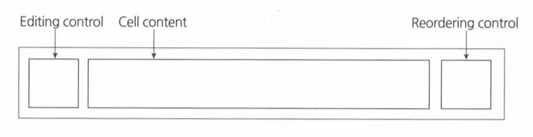
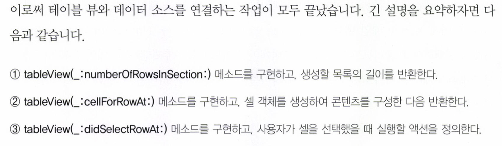
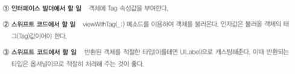
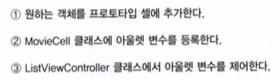
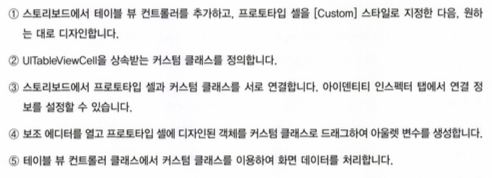

# Ch.19 테이블 뷰를 이용한 데이터 목록 구현
* 테이블 뷰 컨트롤러는 뷰 컨트롤러를 바탕으로 만들어진 특수한 컨트롤러
* 테이블 뷰 컨트롤러에는 테이블 뷰가 루트뷰로 정의되어있는데 이 테이블뷰는 목록형식의 데이터를 화면에 표현하는데에 사용됨
> 테이블 뷰의 계층구조  
> 1.테이블 뷰 컨트롤러  
> 2.테이블 뷰  
> 3.테이블 뷰 셀  
> 4.콘텐츠 뷰  
* 테이블 뷰는 목록을 구성하기 위한 객체이므로 여러개의 행을 가질수 있음
* 이 여러개의 행을 테이블뷰 셀 이라고함
* 테이블 뷰 셀은 다시 내부에 콘텐츠 뷰를 가짐
* 실제로 우리가 보는 화면에서 목록 각 행의 내용은 저마다의 콘텐츠가 콘텐츠뷰 내부에 적절히 배치된 결과물
* 섹션은 하나의 테이블 뷰 내에서 셀들을 그룹으로 묶을 수 있는 단위
* 테이블 뷰 컨트롤러는 UIKit 프레임워크에 UITableViewController 클래스로 구현되어 있음. 이 클래스는 델리게이트 패턴에 기반한 다양한 메소드가 정의되어 있음. 이들의 역할은 데이터를 이용하여 목록을 구성하고 목록에 대한 사용자와의 상호 반응을 지원하는 것

## 19.1 프로토타입 셀
* 프로토타입 셀은 테이블 뷰의 셀을 원하는 대로 쉽게 디자인할 수 있도록 해주는 객체로 테이블 뷰를 설계하는 데에 걸리는 시간과 노력을 대폭 줄여줌
* 테이블 뷰가 화면에 표현될 때 셀의 구성을 미리 보여주기 위한 가상 틀에 불과함

> 프로토타입 셀 영역  
>   
>   
> 1.Cell Content : 셀에 표현될 콘텐츠  
> 2.Accessory View : 콘테츠의 부가 정보 여부를 암시  

* 일반적으로 프로토타입 셀을 이용하여 콘텐츠를 표현할 때의 작업 대부분은 Cell Content영역에서 이루어짐
* 모바일 디바이스에 따라 가로너비가 달라질 경우 Accessory View영역은 너비가 고정값을 유지하는 반면 Cell Content영역은 가변적인 너비값으로 처리됨(가로길이 변화에 따른 주의가 필요함)

> Cell Content  
>   
>   
> 그림이나 사진등 이미지 콘텐츠를 표현하는 Image영역과 텍스트를 표현하는 Text영역으로 나누어짐  

> 표준 편집 인터페이스  
>   
>   
> 목록에서 단순히 행을 삭제하기 위한 목적이면 오른쪽의 Reordering Control영역에 ㅈ공되는 삭제버튼만 사용하면 되지만 복합적인 편집 기능을 제공해야 할 때는 위 그림과 같은 표준 인터페이스를 모두 사용함  
> 행을 추가, 삭제하는 기능은 Editing Control여역에 빨간색 마이너스 아이콘이나 초록색 플러스 버트으로 제공되며, Reordering Control 영역에는 셀의 순서를 재배치 하는 컨트롤이 제공됨  

### 19.1.1 프로토타입 셀을 이용한 테이블 뷰 실습

## 19.2 데이터 소스
* 일반적으로 테이블 뷰를 이용하여 화면에 콘텐츠를 표현하는 방법에는 두 가지가 있음
* 정적인 방법과 동적인 방법
* 정적인 방법은 테이블 뷰 셀 각각을 프로그래밍으로 구성하지 않고 스토리보드에서 직접 구성한 것을 말함
* 테이블 뷰 컨트롤러를 처음 생성하면 테이블 뷰의 속성은 동적 타입으로 지정되어 있지만 우리가 임의로 정적 타입으로 변경할수 있음
* Content속성에서 Static Cells가 정적 타입의 테이블 뷰를 의미함
* 테이블 뷰를 정적 타입으로 바꾸면 기존의 프로토타입 셀은 사라지고 그 자리를 정적인 형식의 셀이 채우게 됨. 이 셀들은 프로토타입 셀과 달리 화면에 직접 표현되므로 내가 필요한 콘텐츠를 직접 올려서 구현할 수 있음
* 반면 고정되지 않고 매번 갱신되는 내용을 표현하려면 테이블 뷰 셀을 프로그래밍적으로 구성해 주어야 하는데 이를 위해 데이터소스가 필요함
* 테이블 뷰의 각 행마다 대응할 수 있도록 배열 형태이기만 하면 데이터 소스가 됨
* 이렇게 만들어진 데이터 소스를 테이블 뷰 각 행에 연결하는 과정을 데이터 바인딩이라 함

### 19.2.1 데이터 소스 만들기
### 19.2.2 테이블 뷰와 데이터 소스 연동
* 데이터 소스와 테이블 뷰를 연동하는 과정은 UITableViewDataSource라는 프로토콜에 의존하여 이루어짐. 테이블 뷰 컨트롤러는 이 프로토콜을 참고하여 지정된 메소드를 호출함으로써 데이터 소스와 테이블 뷰를 연동함. UITableViewController 클래스가 이미 해당 프로토콜을 상속 받고 있음

> 데이터 소스 연동을 위한 핵심 메소드  
> 테이블 뷰와 데이터 소스를 연동하는 데 필요한 기본 메소드는 다음과 같음  
> tableView(_:numberOfROwsInSection:)  
> tableView(_:cellForRowAt:)  
* 이 메소드들은 iOS시스템이 필요에 의해 호출하는 메소드들. 일종의 델리게이트 패턴을 따르고 있음. 동작이나 이벤트에 관한 메소드가 아니기 때문에 델리게이트라는 접미어를 븉이지는 않지만 델리게이트 패턴과 동일한 방식으로 동작함
* 이 메소드들은 이미 UITableView 클래스에서 구현이 되어 있음
> tableView(_:numberOfRowsInSection:)  
> 이 메소드는 테이블 뷰가 생성해야 할 행(row)의 개수를 반환. 이 메소드는 iOS시스템이 테이블 뷰를 구성하기 위해 먼저 호출하는 메소드. 이 메소드는 우리가 사용하기 위한 것이 아니라 시스템이 사용하기 위한 메소드임  
> 이 메소드에 의해 테이블 뷰의 행 수가 결정되는 것임  

>  override func tableView(_ tableView: UITableView, numberOfRowsInSection section: Int) -> Int {   }  
> 첫번째 인자값은 이 메소드를 호출한 테이블 뷰 객체에 대한 정보  
> 두번째 인자값은 섹션에 대한 정보  

> override func tableView(_ tableView: UITableView, cellForRowAt indexPath: IndexPath) -> UITableViewCell {  }  
> 이 메소드는 각 행이 화면에 표현해야 할 내용을 구성하는데에 사용. 이 메소드가 반환하는 값은 전체 테이블 뷰의 목록이 아니라 하나하나의 개별적인 테이블 셀 객체인데 이는 화면에 표현해야할 목록의 수만큼 이 메소드가 반복적으로 호출된다는 것을 의미함  
> 첫번째 매개변수를 통해 테이블 뷰가 특정되면 두번째 매개변수인 indexPath를 통해 몇번째 행을 구성하기 위한 호출인지를 구분할 수 있음.  
> IndexPath 객체 타입으로 정의된 이 매개변수는 선택된 행에 대한 관련 속성들을 모두 제공함. 그중에서도 .row는 가장 많이 사용되는 속성으로 행의 번호를 알려주는 역할을 함  
> 0부터 시작하는 이 행 번호는 배열로 이루어진 데이터 소스의 아이템 인덱스와 대부분의 경우 일치하므로 이 속성을 사용하면 데이터 소스의 필요한 부분을 편리하게 읽어 들일 수 있음.  

> 사용자의 액션 처리를 위한 핵심 메소드  
> tableView(_:didSelectRowAt:)  
> UITableViewDelegate 프로토콜에 정의된 이 메소드는 사용자가 목록중에서 특정 행을 선택 했을때 호출됨  
>  override func tableView(_ tableView: UITableView, didSelectRowAt indexPath: IndexPath) {  }  
> 이 메소드는 델리게이트 메소드이기 때문에 앞의 두 메소드처럼 적절한 시점에 맟추어 자동으로 호출됨. 앞의 두 메소드는 테이블 뷰를 화면에 구현할 때 호출되는데 반해 이 메소드는 사용자의 액션이 있을 때 호출됨  
> 첫번째 인자값이 사용자가 터치한 테이블 뷰에 대한 참조값  
> 두번째 인자값이 터치된 행에 대한 정보  

> 메소드 구현 실습  

```
 override func tableView(_ tableView: UITableView, numberOfRowsInSection section: Int) -> Int {
        return self.list.count
    }
```
* 생성해야 할 행의 개수를 반환 하는 메소드

```
override func tableView(_ tableView: UITableView, cellForRowAt indexPath: IndexPath) -> UITableViewCell {
        
        let row = self.list[indexPath.row]
        
        let cell = tableView.dequeueReusableCell(withIdentifier: "ListCell")!
        
        cell.textLabel?.text = row.title
        
        return cell
        
    }
```
* 이 메소드는 개별 행을 만들어내는 역할을 함. 위의 메소드가 반환하는 값만큼 이 메소드가 반복 호출됨. 이 메소드가 한번 호출 될때 마다 하나의 행이 만들어진다고 생각하면 됨
* 몇번째 행을 구성해야 하는지 알려주기 위해 IndexPath 타입의 객체가 인자값으로 전달됨. 행 번호를 알고자 할 경우 indexPath.row 속성을 사용하면 됨
* 이 속성은 배열과 마찬가지로 0부터 시작
* dequeueReusableCell(withIdentifier:) 메소드는 인자값으로 입력받은 아이디를 이용하여 스토리보드에 정의된 프로토타입 셀을 찾고 이를 인스턴스로 생성하여 제공함



> 개선 및 업그레이드  

## 19.3 커스텀 프로토타입 셀
### 19.3.1 커스텀 프로토타입 셀 구현하기
* 커스텀 타입의 프로토 타입 셀에 디자인된 객체를 소스코드에서 읽어오기 위해서 viewWithTag(_:) 메소드를 사용하는데 이때 객체마다 각각의 태그값이 필요
* 다양한 타입의 뷰 객체(이미지버튼, 스위치버튼 등) 을 모두 메소드 하나로 읽어오는 만큼 반환타입은 UIView 임. 뷰를 상속받은 모든 객체 타입을 포괄할 수 있는 UIView 타입의 객체로 넘겨 받은 다음 필요에 따라 적절한 구체적 타입으로 캐스팅하는것임
* 입력되지 않은 잘못된 태그값을 인자로 호출할 경우를 대비하여 viewWithTag(_:)메소드의 반환값은 옵셔널 타입으로 정의됨
* 커스텀 타입의 프로토타입 셀에 디자인된 객체들은 다음의 과정을 통해 소스코드에서 참조 할 수 있음.



### 19.3.2 커스텀 클래스로 프로토타입 셀의 객체 제어하기
* 프로토타입 셀에 디자인된 객체를 제어하는 또 다른 방법은 커스텀 클래스를 만들어 사용하는 것
* 프로토타입 셀 자체를 커스텀 클래스와 연결한 다음, 셀위에 올려진 객체를 아룰렛 변수로 연결해서 참조하는 것
* 아울렛 변수를 뷰 컨트롤러에 직접 정의하면 셀 내부 객체들이 정적인 객체가 되므로 사용하는데 문제가 생기지만, 프로토타입 셀을 연결한 커스텀 클래스에 아울렛 변수를 정의하면 이는 동적으로 사용할 수 있는 형태의 객체가 되기 때문에 아울렛 변수를 통해 객체를 관리할 수 있음.
* 따라서 태그 속성 사용시 단점으로 꼽혔던 객체관리 문제나 잘못된 태그값을 호출하는 문제로부터 자유로워 질 수 있으며, 유지보수도 무척 편리해짐
* 셀 커스텀하기 위한 클래스는 UITableViewCell을 서브클래싱함
* 프로토타입 셀에 새로운 객체를 추가하고자 할 경우 다음과 같은 순서로 처리



### 19.3.3 프로토타입 셀에 섬네일 이미지 추가하기
* 이미지뷰를 구현하는 기본 클래스는 UIImageView
* 이미지 객체를 화면에 표현해주기 위한 각종 기능과 속성 구현을 담당
* 이미지뷰는 .image 라는 속성을 가지고 있으며 UIImage타입으로 작성된 이미지 객체를 속성에 대입받아 화면에 표현함.
* 이미지뷰의 하위 속성으로 정의되어 있는 UIImage는 이미지 데이터를 저장하는 객체
* 이미지뷰는 이미지를 화면에 표현해주는 기능을 구현한 뷰 이지만 UIImage는 이미지 데이터 자체를 iOS에 맞게 다듬은 객체
* 이미지를 앱 화면에 표시하려면 먼저 이미지를 담아 UIImage객체를 만들고 이 객체를 다시 UIImageView 객체의 .image속성에 대입하는 과정을 거쳐야 함
> var img = UIImage(named: <프로젝트 내 파일 경로>)  
* UIImage(named:) 방식으로 생성한 이미지 객체는 한번 읽어온 이미지를 메모리에 저장해둔 다음 두번째 호출부터는 메모리에 저장된 이미지를 가져옴(캐싱함)
* 이미지 객체로 인한 메모리 점유가 걱정되는 경우 UIImage(contentsOfFile:)생성자를 사용해 이미지 객체 생성 -> 캐싱되지 않음.
> UIImage(contentsOfFile:<프로젝트 내 파일 경로>)  
* 커스텀 클래스를 이용하여 프로토타입 셀을 제어하는 과정정리



## 19.4 테이블뷰의 행 높이를 결정하는 방식
* 코코아 터치 프레임워크에서는 기본적으로 테이블 뷰의 행 높이를 결정하는 두가지 방식을 제공
* 하나는 모두 동일한 높이를 갖는 방식이고 또다른 하나는 각 셀마다 다른 높이를 갖는 방식
* 내부 콘텐츠에 따라 동적으로 셀의 높이가 늘어나거나 줄어드는 방식으로 셀을 구현하는 방식도 제공됨
### 19.4.1 tableView(_:estimatedHeightForRowAt:)
* 이 메소드는 테이블 뷰에서 특정 행의 높이를 설정하고 싶을때 사용하는 메소드
* UITableViewDelegate 프로토콜에 정의되어 있으며 UITableView 클래스에서 이미구현되어 있으므로 커스텀 클래스에서는 override키워드를 붙여 재정의 하는 방식으로 사용하여야 함.
* 행의 높이를 결정하는 것은 UITableView객체의 rowHeight속성 -> 테이블 뷰 내의 모든 셀에 공통으로 적용되어 모두 동일한 높이를 갖는 행으로 만들어줌
* self.tableView.rowHeight = <원하는 행 높이>
* tableView(_:estimatedHeightForRowAt:) 메소드가 구현되면 UITableView 객체의 rowHeight속성은 더이상 행의 높이값으로서 역할을 하지 못함.
* 메소드에서 반환하는 값이 높이값으로 대신 사용이 됨
* 코코아터치 프레임 워크는 행에 대한 정보를 indexPath 매개변수에 담아 tableView(_:estimatedHeightForRowAt:) 메소드를 호출하고 그 결과값을 받아 셀의 높이를 결정함.
* 이점 : 개별적인 행 높이를 제어 할 수 있음.
* 이 메소드가 호출될때 두번째 인자값으로 IndexPath 타입의 행 정보가 함께 전달되기 때문에 이를 이용하여 행 정보를 얻고 그에 따라 알맞은 높이값을 반환하면 됨
> A ?? B  
> 두개의 물음표로 이어진 ?? 는 nil-Coalescing Operator라는 의미의 연산자   
> -> 만약 A가 nil이 아닐경우 옵셔널을 해제하고, nil일 경우 대신 B값을 사용하라!  
> 	이 연산자를 사용하면 옵셔널 타입이 해제된다  
> 	이 연산자의 앞쪽에는 옵셔널 값이, 뒤쪽에는 일반값이 위치한다  
> 	이 연산자의 뒤쪽에 위치한 일반 값의 타입은 앞쪽 옵셔널 값에서 옵셔널을 해제한 타입	과 일치해야 한다  
> * 옵셔널 타입을 해제하면서 동시에 대체 값을 제공해주는 아주 편리한 연산자임  
> * 변수에 옵셔널 타입을 해제한 값을 할당하는 과정에서 해당 값이 nil일 경우를 대비하여 기본 값을 주고자 할 때 매우 유용하게 사용할 수 있음  
> let cell = tableView.dequeueReusableCell(withIdentifier: "cell") ?? UITableViewCell() -> "cell"아이디를 가진 셀을 읽어와 옵셔널을 해제하되, 만약 그값이 nil일 경우 UITableViewCell 인스턴스를 새로 생성한다.  

> 셀프 사이징 셀  
> estimatedRowHeight 프로퍼티  
> UITableViewAutomaticDimension 객체  
> 위 두가지만 이해하고 있으면 됨!  
* estimatedRowHeight 프로퍼티는 셀 전체의 높이를 결정하기 전에 임시로 사용할 셀의 높이값을 나타냄 -> 테이블 뷰는 이 값을 바탕으로 아직 내부 사이즈가 결정되지 않은 셀들을 임시배치하고 그 안에 콘텐츠를 구성함
* UITableViewAutomaticDimension 은 테이블 뷰의 rowHeight속성에 대입되어 높이값이 동적으로 설정될 것을 테이블 뷰에 알려주는 역할 -> 테이블 뷰의 rowHeight속성이 해당 값으로 설정되면 테이블 뷰는 전체 목록이 모두 만들어진 시점에서 셀 내부의 콘텐츠 레이아웃을 계산하고, 그에 따라 셀마다 높이값을 재설정함.
* 위 코드는 viewWillAppear(_:)메소드와 적절한 시점에 넣어서 구현해 주면 됨
    
      
 