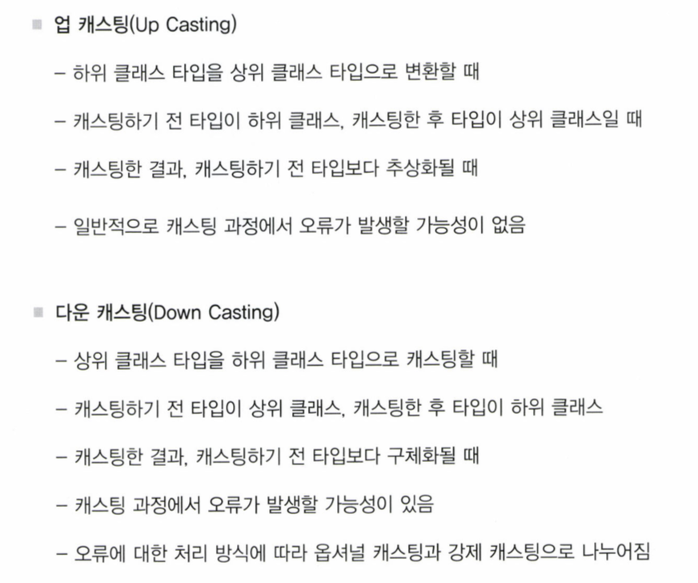

# Ch.8 구조체와 클래스
* 구조체와 클래스 내부에 정의된 변수와 상수는 프로퍼티라는 이름을 가짐
* 구조체와 클래스 내부에 정의된 함수는 메소드라고 함
* 프로퍼티와 메소드를 구조체나 클래스의 멤버라고 함

## 8.1 구조체와 클래스의 기본개념
### 8.1.1 정의 구문
* 구조체는 struct, 클래스는 class 키워드를 사용하여 정의함
* 구조체와 클래스 이름의 첫글자는 대문자, 나머지는 소문자로 작성하는것이 원칙

### 8.1.2 메소드와 프로퍼티
* 구조체와 클래스 내부에서 정의된 변수나 상수를 프로퍼티 또는 속성이라고 함

### 8.1.3 인스턴스
* 타입의 설계도를 사용하여 메모리공간을 할당받은 것이 인스턴스
* 프로퍼티에 접근하려면 반드시 인스턴스를 먼저 생성하여야 함

```
struct Resolution {
    var width = 0
    var height = 0
    
    func desc() -> String {
        return "Resolution 구조체"
    }
}

class VideoMode {
    var interlaced = false
    var frameRate = 0.0
    var name : String?
    
    func desc() -> String {
        return "VideoMode 클래스"
    }
    
    var res = Resolution()
}

//인스턴스 생성
let inRes = Resolution()
let insVMode = VideoMode()

//인스턴스 속성에 접금
let width = inRes.width
print("insRes인스턴스의 width값은 \(width)입니다")

//인스턴스 속성에 접근
let vMode = VideoMode()
print("vMode 인스턴스의 width 값은 \(vMode.res.width)입니다")

//프로퍼티에 값 대입
vMode.name = "Sample"
vMode.res.width = 1280

print("\(vMode.name!)인스턴스의 width값은 \(vMode.res.width)입니다")
---
insRes인스턴스의 width값은 0입니다
vMode 인스턴스의 width 값은 0입니다
Sample인스턴스의 width값은 1280입니다
```

### 8.1.4 초기화
### 8.1.5 구조체의 값 전달방식 : 복사에 의한 전달
### 8.1.6 클래스의 값 전달방식 : 참조에 의한 전달
- - - -
## 8.2 프로퍼티
* 클래스와 구조체 내에서 정의된 변수나 상수
* 저장프로퍼티와 연산프로퍼티는 대체로 클래스나 구조체를 바탕으로 만들어진 개별 인스턴스에 소속되어 값을 저장하거나 연산 처리하는 역할
* 예외적으로 일부 프로퍼티는 클래스와 구조체 자체에 소속되어 값을 가지기도함. 이런 프로퍼티들을 타입 프로퍼티라고함
* 프로퍼티는 클래스의 내부에 메소드의 외부에 정의해야함. (메소드안에서 정의 할 경우 지역변수에 불과함)
* 
### 8.2.1 저장 프로퍼티
* 클래스내에서 선언된 변수나 상수를 부르는 이름
* 선언시 초기값을 할당할수 있지만 반드시 선언하는 시점에서 초기값을 할당해야 하는 것은 아님(초기화 구문에서 초기값을 설정해도 됨)
* But! 클래스에서 프로퍼티를 선언할때 초기값을 함께 할당해주지 않으면 주의가 필요함 -> 반드시 옵셔널 타입으로 선언해 주어야함. 클래스의 프로퍼티에 값이 비어있는경우 인스턴스를 생성할 때 무조건 nil 값으로 초기화 되기 때문
* 옵셔널 타입으로 프로퍼티를 선언할 때에는 일반 옵셔널 타입과 묵시적 옵셔널 해제 타입중에서 선택해서 정의할 수 있음 -> 묵시적 옵셔널 해제 타입으로 지정해두면 이값을 사용할 때 옵셔널 해제 처리할 필요없이 일반변수처럼 쓸수 있기때문에 편리함
* 구조체의 경우 초기값을 할당하지 않고 선언만 하더라도 프로퍼티의 타입을 옵셔널로 지정해 주지 않아도 됨 -> 멤버와이즈 초기화 구문이 제공 되기 때문임
> 저장프로퍼티의 분류  
> 1.var 로 정의되는 변수형 저장 프로퍼티  
> 2.let으로 정의되는 상수형 저장 프로퍼티  
``` 
* 구조체 인스턴스를 변수에 할당할 경우
	* 변수 프로퍼티의 값 변경 가능
	* 상수 프로퍼트의 값 변경 불가
* 구조체 인스턴스를 상수에  할당할 경우 
	* 변수 프로퍼티의 값 변경 불가
	* 상수 프로퍼티의 값 변경 불가
* 클래스 인스턴스를 변수에 할당할 경우
	* 변수 프로퍼티의 값 변경 가능
	* 상수 프로퍼트의 값 변경 불가
* 클래스 인스턴스를 상수에 할당할 경우
	* 변수 프로퍼티의 값 변경 가능
	* 상수 프로퍼트의 값 변경 불가
```

위와 같은 차이는 구조체는 값에 의한 전달, 클래스는 참조에 의한 전달 방식이기 때문

> 지연 저장 프로퍼티  
* 저장 프로퍼티의 정의 앞에 lazy라는 키워드를 붙임
* 클래스 인스턴스가 생성되어 모든 저장 프로퍼티가 만들어지더라도 lazy키워드가 붙은 프로퍼티는 선언만 될뿐 초기화 되지 앟고 계속 대기하고 있다가 프로퍼티가 호출되는 순간에 초기화가 됨
> 클로저를 이용한 저장 프로퍼티 초기화  
> --------------------421페이지 추가  


### 8.2.2 연산 프로퍼티
* 연산프로퍼티는 필요한 값을 제공한다는 점에서 저장 프로퍼티와 같지만, 실제 값을 저장했다가 반환하지는 않고 대신 다른 프로퍼티의 값을 연산 처리하여 간접적으로 값을 제공함
* 이때 프로퍼티의 값을 참조하기 위해 내부적으로 사용하는 구문이 get구문 -> 내부적으로 return키워드를 사용하여 값을 반환하는데 이 값이 프로퍼티가 제공하는 값임
* 연산프로퍼티는 선택적으로 set구문을 추가할 수도 있음 -> 연산 프로퍼티에 값을 할당하거나 변경하고자 할 때 실행되는 구문 -> 연산의 중요한 요소로 사용됨
* set구문이 생략되면 외부에서 연산 프로퍼티에 값을 할당 할 수 없으며, 내부적인 연산처리를 통해 값을 제공받는 읽기 전용 프로퍼티가 만들어짐
* get구문은 연산 프로퍼티에 필수요소! -> 생략시 연산 프로퍼티가 값을 반환하는 기능 자체를 갖지 못함
* 연산 프로퍼티는 항상 클래스나 구조체 또는 열거형 내부에서만 사용할 수 있음
* 연산 프로퍼티는 다른 프로퍼티에 의존적이거나, 혹은 특정 연산을 통해 얻을 수 있는 값을 정의 할 때 사용됨
* set구문에서 매개변수명이 생략된다면 "newValue"라는 기본 인자명이 사용됨

### 8.2.3 프로퍼티 옵저버
* 프로퍼티의 값을 직접 변경하거나 시스템에 의해 자동으로 변경하는 경우에 상관없이 일단 프로퍼티의 값이 설정되면 무조건 호출됨
* 종류
> willSet  
프로퍼티의 값이 변경되기 직전에 호출되는 옵저버
> didSet  
프로퍼티의 값이 변경된 직후에 호출되는 옵저버

### 8.2.4 타입 프로퍼티
* 인스턴스를 생성하지 않고 클래스나 구조체 자체에 값을 저장하게 되는 프로퍼티
* 타입 프로퍼티는 클래스나 구조체의 인스턴스에 속하는 값이 아니라 클래스나 구조체 자체에 속하는 값이므로 인스턴스를 생성하지 않고 클래스나 구조체 자체에 저장하게 되며, 저장된 값은 모든 인스턴스가 공통으로 사용할 수 있음
* 타입 프로퍼티의 값은 복사된 것이 아니라 실제로 하나의 값이므로 하나의 인스턴스에서 타입 프로퍼티의 값을 변경하면 나머지 인스턴스들이 일괄적으로 변경된 값을 적용받음. 이런 특성때문에 타입 프로퍼티는 특정 클래스나 구조체, 그리고 열거형에서 모든 인스턴스들이 공유해야 하는 값을 정의할 때 유용
* 타입 프로퍼티를 선언하는 요령은 클래스와 구조체 모두에서 같음
* 타입 프로퍼티로 사용할 프로퍼티 앞에 static 키워드만 추가해주면 됨
* class 키워드를 사용하여 타입 프로퍼티를 선언하면 상속받은 하위 클래스에서 재정의할 수 있는 타입 프로퍼티가 됨
* 이를 이용하여 정의한 저장 프로퍼티를 타입 프로퍼티로 선언할 때에는 초기값을 반드시 할당해야 함. 타입 프로퍼티는 인스턴스와 상관없기 때문에 인스턴스 생성 과정에서 초기값을 할당할 수 없기 때문

```
struct Foo {
    // 타입 저장 프로퍼티
    static var sFoo = "구조체 타입 프로퍼티값"
    // 타입 연산 프로퍼티
    static var cFoo : Int {
        return 1
    }
}

class Boo {
    //타입 저장 프로퍼티
    static var sFoo = "클래스 타입 프로퍼티값"
    //타입 연산 프로퍼티
    static var cFoo : Int {
        return 10
    }
    //재정의가 가능한 타입 연산 프로퍼티
    class var oFoo : Int { // Boo클래스를 상속받는 하위 클래스에서 재정의할 수 있는 타입 프로퍼티
        return 100
    }
}

print(Foo.sFoo)
Foo.sFoo = "새로운 값"
print(Foo.sFoo)

print(Boo.sFoo)
print(Boo.cFoo)
```

- - - -
## 8.3 메소드
* 메소드는 일종의 함수로서, 클래스나 구조체, 열거형과 같은 객체 내에서 함수가 선언될 경우 이를 메소드라고 통칭함. 즉 메소드는 특정 타입의 객체 내부에서 사용하는 함수라고 할 수 있음
* 함수와 메소드의 차이점은 구현 목적이 가지는 독립성과 연관성에 있음
> 인스턴스 메소드  
객체의 인스턴스를 생성해야 사용할 수 있는 메소드
> 타입메소드   
객체의 인스턴스를 생성하지 않아도 사용할 수 있는 메소드

### 8.3.1 인스턴스 메소드
* 인스턴스 메소드는 클래스, 구조체 또는 열거형과 같은 객체타입이 만들어 내는 인스턴스에 소속된 함수
* 객체의 인스턴스에 대한 기능적인 측면을 제공함
* 객체 타입 내부에 선언된다는 점을 제외하고는 일반 함수와 선언하는 형식이 완전히 동일
* 구조체나 클래스, 열거형 등의 객체 타입을 인스턴스화 한 후 이 인스턴스를 통하여 호출하게 됨

```
struct Resolution {
    var width = 0
    var height = 0
    
    func desc() -> String {
        let desc = "이 해상도는 가로\(self.width) X \(self.height)로 구성됨"
        return desc
    }
}

class VideoMode {
    var resolution = Resolution()
    var interlaced = false
    var frameRate : Double = 0.0
    var name : String?
    
    func desc() -> String {
        if self.name != nil {
            let desc = "이\(self.name!) 비디오 모드는 \(self.frameRate)의 프레임 비율로 표시됨"
            return desc
        } else {
            let desc = "이 비디오모드는 \(self.frameRate)의 프레임 비율로 표시됨"
            return desc
        }
        
    }
    
}
```

* 인스턴스 메소드 내에서 프로퍼티를 읽어올 경우 다음 형식으로 참조해야함
> self.프로퍼티명  
* 프로퍼티 앞에 붙은 self키워드는 클래스나 구조체의 인스턴스 자신을 가리킴
* 구조체나 열거형의 인스턴스 메소드 내부에서 프로퍼티의 값을 수정할 때에는 반드시 메소드 앞에 mutating이라는 키워드를 추가해야함
* 구조체나 열거형 인스턴스를 상수로 할당받으면 mutating 메소드를 호출할 수 없음( let aaa = struct or enum () )

### 8.3.2 타입 메소드
* 인스턴스를 생성하지 않고도 객체 타입 자체에서 호출할 수 있는 메소드
* 구조체나 열거형, 클래스 모두 타입 메소드를 선언할 때에는 static 키워드를 사용
* 반면 하위 클래스에서 재정의 가능한 타입 메소드를 선언할 때는 class키워드를 사용(클래스 타입에서만 사용 가능)
* 인스턴스 메소드는 객체 타입의 인스턴스에 대해 호출하는 것이지만 타입 메소드는 객체 자체에 대해 호출

```
class Foo {
    class func fooTypeMethod(){
        
    }
}
let f = Foo()
Foo.fooTypeMethod() // 객체자체에 대해 호출해야함
f.fooTypeMethod() // 오류
```

* 타입 메소드를 사용하여 객체의 값을 변경하면 해당 객체 타입을 사용하는 모든 곳에서 변경된 값이 적용됨
* 인스턴스 메소드는 두개의 인스턴스를 생성하여 메소드를 실행하면 메소드에 의해 값이 변하더라도 해당 인스턴스에만 국한되어 값이 변하고 나머지 인스턴스에는 영향을 미치지 않음
* 그러니 타입 메소드는 객체 타입 전체에 영향을 미침
* 타입 메소드에서 사용할수 있는 프로퍼티는 오직 타입 프로퍼티뿐임 
- - - -
## 8.4 상속(클래스만을 위함)
* 한 클래스가 다른 클래스에서 정의된 프로퍼티나 메소드를 물려받아 사용하는 것

```
 class A {
    var name = "Class A"
    
    var description : String { //읽기전용
        return "이 클래스의 이름은 \(self.name)"
    }
    
    func foo() { //읽기전용
        print("\(self.name)의 메소드 foo는 호출됨")
    }
}

let a = A()
a.name
print(a.description)
a.foo()
```

### 8.4.1 서브클래싱
* 클래스 A를 상속받아 새로운 클래스를 정의(서브클래싱)
* 기존에 있는 클래스를 기반으로 하여 새로운 클래스를 작성하는 과정
* swift는 단일상속만 지원됨(클래스는 하나의 클래스만 상속받을 수 있음)

```
class A {
    var name = "Class A"
    
    var description : String { //읽기전용
        return "이 클래스의 이름은 \(self.name)"
    }
    
    func foo() { //읽기전용
        print("\(self.name)의 메소드 foo는 호출됨")
    }
}

let a = A()
a.name
print(a.description)
a.foo()

class B : A {
    var prop = "Class B"
    
    func boo() -> String {
        return "Class B prop = \(self.prop)"
    }
}

let b = B()
print(b.prop)
b.boo()
print(b.name)
b.foo

b.name = "Class C"
b.foo()
---
이 클래스의 이름은 Class A
Class A의 메소드 foo는 호출됨
Class B
Class A
Class C의 메소드 foo는 호출됨
```

```
class Vehicle {
    var currentSpeed = 0.0
    
    var description : String {
        return "시간당 \(self.currentSpeed)의 속도로 이동"
    }
    func makeNoise(){
        
    }
}

let baseVehicle = Vehicle()
baseVehicle.description
print(baseVehicle.description)

class Bicycle : Vehicle {
    var hasBasket = false
}

let bicycle = Bicycle()
bicycle.hasBasket = true
bicycle.currentSpeed = 20.0
print("자전거 : \(bicycle.description)")

class Tandem : Bicycle {
    var passengers = 0
}

let tandem = Tandem()
tandem.hasBasket = true
tandem.passengers = 2
tandem.currentSpeed = 14.0

print("tandem: \(tandem.description)")
---
시간당 0.0의 속도로 이동
자전거 : 시간당 20.0의 속도로 이동
tandem: 시간당 14.0의 속도로 이동
```

### 8.4.2 오버라이딩
* 자식클래스에서 재정의된 메소드나 프로퍼티는 부모 클래스로부터 물려받은 내용을 덮어쓰게 되는데 이 과정을 오버라이딩이라고함
* 오버라이딩한 내용은 자기 자신 또는 자신을 서브클래싱한 하위 클래스에만 적용됨
* 오버라이딩하려는 메소드나 프로퍼티의 선언 앞에 override 키워드를 붙여야함
* override 키워드는 부모 클래스나 그 이상의 상위 클래스에서 반드시 선언되어 있고 이를 재정의할 때만 붙일 수 있는 키워드
* 프로퍼티를 오버라이딩할 때에는 상위 클래스에서 저장 프로퍼티였건, 연산 프로퍼티였건 관계없이 연산 프로퍼티의 형태로 오버라이딩해야함.
* 본래 저장 프로퍼티는 읽고 쓰기가 모두 허용되는 만큼 연산 프로퍼티로 오버라이딩할 경우 get, set 구문을 모두 제공해야함
* 저장 프로퍼티를 읽기전용 연산 프로퍼티로 오버라이딩 할 수는 없음
* get, set 이 모두 제공되던 연산 프로퍼티를 오버라이딩할 때에도 역시 get, set 구문을 모두 제공해야함


* 프로퍼티 오버라이딩은 상위 클래스의 기능을 하위 클래스가 확장, 또는 변경하는 방식으로 진행되어야지, 제한하는 방식으로 진행되어서는 안됨

```
class Vehicle {
    var currentSpeed = 0.0
    
    var description : String {
        return "시간당 \(self.currentSpeed)의 속도로 이동"
    }
    func makeNoise(){
        
    }
}

class Bicycle : Vehicle {
    var hasBasket = false
}

class Tandem : Bicycle {
    var passengers = 0
}

class Car : Vehicle {
    var gear = 0
    var engineLevel = 0
    
    override var currentSpeed: Double { //부모클래스의 저장프로퍼티 -> 연산프로퍼티
        get {
            return Double(self.engineLevel * 50)
        }
        set {
            //비워둠
        }
    }
    override var description: String { //부모클래스에서 읽기전용 프로퍼티 -> 읽고 쓰기 가능한 프로퍼티로 변경
        get {
            return "Car : engineLevel = \(self.engineLevel), so currentSpeed = \(self.currentSpeed)"
        }
        set {
            print("new value is \(newValue)")
        }
    }
}


let c = Car()
c.engineLevel = 5
print(c.currentSpeed)
c.description = "New Class Car" //변경

print(c.description) // get, set 구문 출력

--- 프로퍼티 옵저버
class AutomaticCar : Car {
    override var currentSpeed: Double {
        didSet {
            self.gear = Int(currentSpeed / 10.0) + 1  //현재속도가 변할때 그에 따라 기어수도 함께 변경될수 있도록 didSet옵저버 추가
        }
    }
}

```

* 메소드 오버라이딩은 오버라이딩 대상이 되는 메소드의 매겨변수 개수나 타입 그리고 반환타입을 변경할 수 없음.(매개변수의 순서도 변경할수 없음)
* 매개변수 타입이나 반환 타입은 반드시 그래도 유지해야함
* 같은 메소드 이름이지만 매개변수의 변화만으로 새로운 메소드를 만들어 적재할 수 있도록 지원하는 문법은 오버로딩
* 오버라이딩 하는 대상 메소드의 매개변수 타입이 달라지거나 매개변수의 개수가 달라지면 오버로딩 문법에 의해 새로운 메소드로 인식하므로 이는 오버라이딩 대상에 포함되지 않음
* 상속받은 부모 클래스의 인스턴스를 참조할 수 있도록 super라는 객체를 제공하는데 이 객체를 이용하여 점 구문을 함께 사용하면 부모클래스의 프로퍼티나 메소드를 호출할 수 있음
* 상위 클래스에서 정의한 메소드나 프로퍼티가 하위 클래스에서 오버라이딩되는 것을 차단할 수 있도록 final 키워드를 지원
* final 키워드는 클래스 자체에도 붙일 수도 있음, 이경우 상속자체가 차단됨


```

class Vehicle {
    final var currentSpeed = 0.0
    
   final var description : String {
        return "시간당 \(self.currentSpeed)의 속도로 이동"
    }
    final func makeNoise(){
        
    }
}
```

## 8.5 타입 캐스팅
*  부모 클래스로부터 상속된 자식 클래스는 자기 자신의 타입이기도 하면서, 동시에 부모 클래스의 타입이기도 함. 이는 부모 클래스의 특성을 물려받았기 때문
* 자식 클래스는 본래의 타입 대신 부모 클래스 타비으로 선언하여 사용할 수 있음 

```
class Vehicle {
    var currentSpeed = 0.0
    
    func accelerate() {
        self.currentSpeed += 1
    }
}

class Var : Vehicle {
    var gear : Int{
        return Int(self.currentSpeed / 20) + 1
    }
    func wiper(){
        
    }
}

let trans : Vehicle = Car()

```

*  상속을 거듭해 갈수록 하위 클래스는 상위 클래스보다 점차 구체화 되어 가며 상대적으로 상위 클래스는 하위 클래스보다 추상화 되어감.
* 함수나 메소드의 인자값을 정의할 때 하위 클래스 타입으로 선언한는 것보다 상위 클래스 타입으로 선언하면 인자값으로 사용할 수 있는 객체의 범위가 훨씬 넓어짐
> func move(param : SUV {  
> 	param.accelerate()  
> }  
* SUV클래스 이거나 적어도 이 클래스를 상속받은 하위 클래스의 인스턴스만 인자값으로 사용할수 있음
> func move(param : Vehicle) {  
> 	param.accelerate()  
> }  
* Vehicle 클래스나 이를 상속받은 모든 클래스의 인스턴스를 인자값으로 사용할 수 있게됨
* 배열과 딕셔너리도 마찬가지임
> var list = [SUV]()  
> list.append[(SUV)]()  
* 만약 상위 클래스인 Vehicle을 아이템 타입으로 사용한다면 다음 모두 가능
> var list = [Vehicle]()  
> list.append[(Vehicle)]()  
> list.append[(Car)]()  
> list.append[(SUV)]()  

### 8.5.1 타입 비교 연산
* 스위프트는 타입 비교 연산자 is 를 지원함. 변수나 상수 또는 인스턴스에 이 연산자를 사용하면 할당된 값을 비교하는 것이 아니라 타입이 일치하는지 여부를 비교하여 그 결과를 Bool형태로 돌려줌
> 인스턴스(또는 변수, 상수) is 비교대상 타입  
* 타입을 비교 연산할 때 연산자 왼쪽에 인스턴스가 아니라 인스턴스가 할당된 변수가 사용될 경우 다소 주의해야함. 변수가 선언된 타입을 기준으로 비교하는 것이 아니라 변수에 할당된 실제 인스턴스를 기준으로 타입을 비교
```
let myCar : Vehicle = SUV()

if myCar is SUV {
    print("myCar는 SUV타입입니다")
}else {
    print("myCar는 SUV타입이 아닙니다")
}

let newCar : Vehicle = Car()

if newCar is SUV {
    print("newCar는 SUV타입입니다")
}else {
    print("newCar는 SUV타입이 아닙니다")
}
---
myCar는 SUV타입입니다
newCar는 SUV타입이 아닙니다

```

### 8.5.2 타입 캐스팅 연산
> let someCar : Vehicle = SUV()  
* someCar는 Vehicle타입 이므로 Vehicle 클래스에 선언되지 않은 프로퍼티나 메소드를 사용할수 없음.
* someCar상수를 이용하여 SUV() 클래스에 선언된 프로퍼티를 사용하고 싶거나 SUV타입을 인자값으로 받는 함수에 사용하려면 타입캐스팅이 필요
* 일반적으로 타입 캐스팅은 상속관계에 있는 타입들 사이에서 허용됨
* 타입캐스팅은 캐스팅 전 타입과 캐스팅 후 타입의 상위/하위 관계에 따라 업 캐스팅 과 다운 캐스팅으로 나누어짐
* 업 캐스팅은 일반적으로 캐스팅 과정에서 오류가 발생할 가능성이 없음
* 다운 캐스팅은 상위 클래스 타입의 객체를 하위 클래스 타입으로 캐스팅하는 것을 의미



* 다운 캐스팅 과정에서 오류가 발상하면 nil이 반환됨. 이같은 결과값을 고려하여 다운 캐스팅은 옵셔널 타입을 반환하는 옵셔널 캐스팅과 반드시 캐스팅에 성공한다는 전제하에 일반 타입으로 반환하는 강제 캐스팅으로 나누어짐
* 타입 캐스팅을 위한 연산자는 as 
> 업 캐스팅  
> >> 객체 as 변환할 타입  
> 다운 캐스팅  
> >> 객체 as? 변환할 타입(결과는 옵셔널 타입)  
> >> 객체 as!  변환할 타입(결과는 일반 타입)  

```
업 케스팅
let anyCar : Car = SUV()
let anyVehicle = anyCar as Vehicle

다운 캐스팅
let anySUV = anyCar as? SUV
if anySUV != nil {
    print("캐스팅이성공")
}
```

### 8.5.3 Aay, AnyObject
	* 상속관계에 있지 않아도 타입 캐스팅 할 수 있는 예외가 있는데 바로 Any와 AnyObject 타입을 사용할 때임
	* 무엇이든 다 받아들일 수 있는 일종의 범용 타입
	* AnyObject는 클래스의 일종으로 모든 종류의 클래스 타입을 저장할 수 있는 범용타입의 클래스
	* 모든 클래스의 인스턴스는 AnyObject 클래스 타입으로 선언된 변수나 상수에 할당할 수 있음
	* 모든 클래스의 인스턴스는 AnyObject 타입으로 선언된 함수나 메소드의 인자값으로 사용될 수도 있으먀, AnyObject 타입을 반환하는 함수나 메소드는 모든 종류의 클래스를 반환할 수 있다는 의미로 해석 되기도함
	* 고정된 하나의 타입만을 저장할 수 있는 배열이나 딕셔너리, 집합에서도 AnyObject 타입을 사용할수 있는데 이는 모든 클래스를 저장할 수 있다는 뜻임
	* AnyObject는 클래스 특성상 항상 다운 캐스팅만 수행됨
	* 구조체나 열거형은 AnyObject 타입으로 정의를 허용하지 않음
	* Any 는 클래스 뿐만 아니라 원시자료형, 구조체, 열거형, 심지어 함수까지 허용됨. 즉, 어떤 변수의 타입이 Any로 선언되었다면 이 변수는 종류에 상관없이 모든 타입의 객체를 저장할 수 있음
	* Any타입에 할당된 객체가 사용할 수 있는 프로퍼티나 메소드는 아예 제공되지 않음. 모든값을 제한없이 할당받을 수 있지만, 그 값을 이용하여서 할 수 있는것은 거의 없어지는 셈

## 8.6 초기화 구문
* 구조체나 클래스는 모두 정의된 내용을 그대로 사용할 수는 없음.
* 항상 인스턴스를 생성해서 메모리 공간을 할당받은 다음에 사용해야함
* 이를 초기화라고 함
* 초기화 과정에서 가장 중요한 것은 저장 프로퍼티, 모든 저장 프로퍼티는 인스턴스 생성 과정에서 초기화되어야 하며 이를 위해서 반드시 초기값이 지정되어 있어야 함
### 8.6.1 init 초기화 메소드
> 1. 초기화 메소드의 이름은 init 으로 통일된다  
> 2.매개변수의 개수, 이름, 타입은 임의로 정의할 수 있다  
> 3.매개변수의 이름과 개수, 타입이 서로 다른 여러 개의 초기화 메소드를 정의할 수 있다.  
> 4. 정의된 초기화 메소드는 직접 호출되기도 하지만, 대부분 인스턴스 생성시 간접적으로 호출된다.  
* init 메소드가 작성되고 나면 작성된 init메소드가 어떤 인자값 형식을 갖는가에 상관없이 그 객체의 기본 초기화 구문은 더는 제공되지 않음
* init 역시 메소드 이므로 매개변수에 기본값을 지정할 수 있음
* 기본값이 지정된 메소드에서는 인자값을 생략할 수 있으며, 이때 생략된 인자값 대신 기본값이 인자값으로 사용됨
```
struct Resolution {
    var width = 0
    var height = 0
    
    init(width : Int){
        self.width = width
    }
}

class VideoMode {
    var resolution = Resolution(width : 2048)
    var interlaced = false
    var frameRate = 0.0
    var name : String?
    
    init(interlaced : Bool, frameRate : Double) {
        self.interlaced = interlaced
        self.frameRate = frameRate
    }
    init(name : String) {
        self.name = name
    }
    init(interlaced : Bool){
        self.interlaced = interlaced
    }
    init(interlaced : Bool, frameRate : Double, name : String) {
        self.interlaced = interlaced
        self.frameRate = frameRate
        self.name = name
    }
}

//인스턴스 생성
let resolution = Resolution.init(width: 4096)
let videoMode = VideoMode.init(interlaced: true, frameRate: 40.0)

let nameVideoMode = videoMode("이재성")
let simpleVideoMode = VideoMode(interlaced: true)
let doubleVideoMode = VideoMode(interlaced: true, frameRate: 40.0)
let tripleVideoMode = VideoMode(interlaced: true, frameRate: 50.0, name: "이재성")

class videoMode {
    var name : String?
    
    init(name : String = ""){
        self.name = name
    }
}
//이경우 2가지 초기화 가능
let defaultVideoMode = videoMode()
let defaultVideoMode = VideoMode(name: "이재성")
```

### 8.6.2 초기화 구문의 오버라이딩
* 클래스에서는 초기화 구문도 일종의 메소드 이므로 자식 클래스에서 오버라이딩 할 수 있음
* 기본초기화 구문 init()은 부모클래스에서 명시적으로 선언된 적이 없더라도 이를 상속받은 자식 클래스에서는 반드시 오버라이딩 형식으로 작성해야함
* 초기화 구문을 오버라이딩 하면 더 이상 부모클래스에서 정의한 초기화 구문이 실행되지 않음.
* 초기화 구문을 오버라이딩 할 경우 부모 클래스에서 정의된 초기화 구문을 내부적으로 호출해야 하는데, 오버라이딩된 초기화 구문 내부에 super.init 구문을 작성하면 됨
> 초기화 구문 델리게이션  
> 기본 초기화 구문을 제외한 나머지 초기화 구문을 오버라이딩할 때는 반드시 부모 클래스의 초기화 구문을 호출함으로써 델리게이션 처리를 해 주어야 함  
> 기본 초기화 구문의 경우는 주어진 상황별로 조금씩 다름  
> 부모클래스에 기본 초기화 구문만 정의되어 있거나 기본 초기화 구문이 아예 명시적으로 정의 되어 있지 않은 상태에서 자식 클래스가 오버라이딩 할 때에는 super.init()구문을 호출해주지 않아도 자동으로 부모 클래스의 초기화 구문이 호출됨  
```
class Base {
    var baseValue : Double
    
    init() {
        self.baseValue = 0.0
        print("Base init")
    }
}

class ExBase : Base {
    override init(){ ~// 부모클래스가 기본초기화 구문만 있으므로 super.init 호출하지 않아도 됨~
        print("ExBase init")
    }
}

let ex = ExBase()
```

```
class Base {
    var baseValue : Double
    
    init() {
        self.baseValue = 0.0
        print("Base init")
    }
    init(baseValue : Double){ ~//다른 형식의 초기화 구문 추가시~
        self.baseValue = baseValue
    }
}

class ExBase : Base {
    override init(){
        super.init() ~//명시적으로 부모클래스의 기본 초기화구문 호출해야함~
        print("ExBase init")
    }
}

let ex = ExBase()
```

## 8.7 옵셔널 체인
### 8.7.1 옵셔널 타입의 문제점
* 옵셔널 타입은 항상 nil 여부를 검사하여 정상적이 값이 저장된 것을 확인한 후에 사용하는 것이 안전하므로 if 구문을 통해 옵셔널 타입을 처리하는 경우가 많음(옵셔널에 대한 이슈)
* 클래스나 구조체가 옵셔널 타입과 관련되었을때 문제가 발생. 구조체나 클래스의 인스턴스가 옵셔널 타입으로 선언될 경우 프로퍼티와 메소드를 호출하기 위해서는 매번 if 구문을 통해 옵셔널 인스턴스의 정상값 여부를 검사해야함
```
struct Human {
    var name : String?
    var man : Bool = true
}

struct Company {
    var ceo : Human?
    var companyName : String?
}

var startup : Company? = Company(ceo : Human(name : "나대표", man : false), companyName: "루비페이퍼")
//startup 옵셔널 해제
if let company = startup {
    if let ceo = company.ceo {
        if let name = ceo.name {
            print("대표이사의 이름은 \(name)입니다")
        }
    }
}
```

### 8.7.2 옵셔널 체인
* 옵셔널 체인은 옵셔널 타입으로 정의된 값이 하위 프로퍼티나 메소드를 가지고 있을 때, 이 요소들을 if구문을 쓰지 않고도 간결하게 사용할 수 있는 코드를 작성하기 위해 도입
* 객체가 nil인 상황에서 안전성 검사를 하지 않고 메소드나 프로퍼티를 호출하더라도 오류가 발생하지 않을 수 있는 문법을 옵셔널 스타일을 이용하여 구현
* 옵셔널 체인으로 처리할 수 있는 것은 하위 속성이나 메소드를 호출해야 할 떄임
> startup?.ceo?.name  
* 마지막 name 값은 하위속성이나 메소드를 호출하는 것이 아니라 직접 사용해야 하는 값이므로 옵셔널에 대한 검사가 필요함
* 하지만 값을 참조하는것이 아니라 할당해야 한다면 옵셔널 체인을 이용하여 다음과 같이 간편하게 구문을 작성할 수 있음
> startup?.ceo?.name = “이재성천재”  
* 옵셔널 체인의 특징
	* 옵셔널 체인으로 참조된 값은 무조건 옵셔널 타입으로 반환된다
	* 옵셔널 체인 과정에서 옵셔널 타입들이 여러 번 겹쳐 있더라도 중첩되지 않고 한번만 처리된다.
* 옵셔널 체인 구문에서 마지막에 오는 값이 옵셔널 타입이 아닌 일반 값일지라도 옵셔널 체인을 통해 참조 했다면 이 값은 옵셔널 타입으로 변경됨
```
//옵셔널
struct Human {
    var name : String?
    var man : Bool = true
}

struct Company {
    var ceo : Human?
    var companyName : String?
    func getCEO() -> Human? {
        return self.ceo
    }
}

var startup : Company? = Company(ceo : Human(name : "나대표", man : false), companyName: "루비페이퍼")
//startup 옵셔널 해제
if let company = startup {
    if let ceo = company.ceo {
        if let name = ceo.name {
            print("대표이사의 이름은 \(name)입니다")
        }
    }
}
//옵셔널 체인
if let name = startup?.ceo?.name {
    print("대표이사의 이름은 \(name)입니다")
}

let name = startup?.getCEO()?.name
if name != nil {
    print("대표이사의 이름은 \(name!)입니다")
}
```

