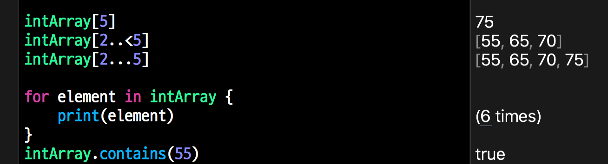

# Ch2. 스위프트 기본 데이터 구조의 활용
- 스위프트의 표준 라이브러리는 데이터 타입, 컬렉션 타입, 함수와 메소드 그리고 다양한 목적에 부합하는 다수의 프로토콜 등을 제공
- 2장 주요내용
	- 스위프트의 표준 라이브러리
	- 서브스크립트 구현 방식
	- immutability 데이터 타입의 이해
	- 스위프트와 Objective-C의 상호 관련성
	- 스위프트의 프로토콜 지향 프로그래밍

## 스위프트 표준 라이브러리의 활용
- 스위프트의 표준 라이브러리는 스위프트 프로그래밍 언어와 구분되는 별개의 요소이자, 클래스, 구조체, 열거형, 함수, 프로토콜 등 스위프트 언어를 활용하기 위한 핵심 도구이다.

### 애플이 구조체를 사용하는 이유
- 스위프트에 정의된 타입 대부분은 구조체(Value Type)
- 구조체를 이용하여 클래스를 지원하도록 한 이유는
- 상속, 초기화 해제객체, 레퍼런스 카운팅등 다양한 기능을 제공하는 클래스에 비해 훨씬 제한된 수의 기능을 제공하는 스위프트가 표준 라이브러리의 구성 요소로서 적합하기 때문
- 또 구조체는 벨류 타입으로서 단 하나의 소유 객체만을 지니며, 새로운 변수에 할당하거나 함수에 전달할 때는 항상 복사해서 사용한다는 점도 중요한 이유
- 스위프트의 구조체의 주요기능
	- 자동으로 생성되는 멤버 초기화 함수(memberwise initializer)외에, 커스텀 초기화 함수도 사용 가능
	- 메소드를 지닐 수 있음
 	- 프로토콜을 구현할 수 있음

- 아래 조건중 하나라도 해당된다면 클래스보다는 구조체를 사용하는 편이 낫다고 애플 가이드라인은 설명한다.
 	- 특정 타입 생성의 가장 중요한 목적이 간단한 몇 개의 값을 캡슐화 하는것인 경우
 	- 캠슐화한 값을 구조체의 인스턴스에 전달하거나 할당할 때 참조가 아닌 복사를 할 경우
 	- 구조체에 의해 저장되는 프로퍼티를 참조가 아닌 복사를 위한 벨류 타입인 경우
 	- 기존의 타입에서 가져온 프로퍼티나 각종 기능을 상속할 필요가 없는 경우

### 스위프트에서 배열 선언
- 스위프트의 배열과 Objective-C의 배열의 몇가지 중요한 차이점
	- 반드시 동일 타입의 값만 저장해야 한다는 것
	- 클래스 타입이 있음(스위프트 배열은 generic type collections)
	- 클래스가 아닌 구조체로서 정의됨

- 스위프트에는 다음과 같은 세가지 유형의 배열이 있음
	- Array
	- ContiguousArray
	- ArraySlice

- 모든 Array 클래스는 배열에 포함된 배열 요소를 저장하기 위한 메모리 공간을 유지한다.
- 배열 요소의 타입이 클래스 또는 @objc 프로토콜 타입이 아닌 경우, 배열의 메모리 영역은 인접 블록에 저장된다.
- 배열 요소의 타입이 클래스 또는 @objc 프로토콜 타입인 경우, 배열의 메모리 영역은 인접 블록에 NSArray의 인스턴스 또는 NSArray의 서브클래스의 인스턴스로 저장된다.
- 저장하려는 배열 요소가 클래스 또는 @objc 프로토콜인 경우 ContiguousArray 유형을 사용하면 좀더 효율적인 코드를 작성할 수 있다.
- ContiguousArray가 Array와 다른 점은 Objective-C와의 브릿징을 지원하지 않는다는 것
- ArraySlice 도 배열요소를 저장할 때 인접 메모리 공간을 사용하며, Objective-C와의 브릿징을 지원하지 않는다.
- ArraySlice의 가장 큰 특징은 이미 존재하는 또 다른 배열 타입의 일부 그룹을 대표한다는 것
- Array, ContiguousArray, ArraySlice의 인스턴스를 생성하면 해당 배열 요소를 저장하기 위한 추가 저장공간이 할당된다.
- 스위프트의 배열은 기하급수적 증가전략을 따르며, 배열에 요소가 추가될 때마다 소진된 배열 용량을 자동으로 증가시킨다.
- 배열 요소 추가작업을 여러차례 나눠서 반복적으로 진행할 경우, 각각의 추가 작업에는 일정한 시간이 소요된다.


- 위 예제의 실행결과를 보면 500개의 용량을 예약 했지만 실제 할당된 공간은 그보다 크다는 사실을 알 수 있다.
- 스위프트가 실행 성능을 고려해서 실제 요청한 양 이상을 할당한 것으로 볼수 있으며, 최소한 예약한 배열 용량만큼은 확보할 수 있음을 알 수 있다.

### 배열 초기화
- 스위프트 표준 라이브러리는 세 가지 타입의 배열을 구현하기 위해 네 가지 초기화 메소드를 제공


### 배열에 요소 추가 및 업데이트
- 배열에 새로운 요소를 추가할 때는 append(_:) 메소드를 사용한다.
- 이 메소드는 배열의 맨 마지막 부분에 새로운 요소를 추가한다.
- 특정한 배열 인덱스 위치에 요소를 추가하려 할 경우 insert(newElement:at:) 메소드를 사용한다.
- 이 메소드는 newElement를 인덱스 값이 i인 위치에 삽입한다.
- 특정 인덱스 위치의 배열 요소를 교체하려 할 경우 서브스크립트 문법을 사용할 수 있다


### 배열에서 요소 가져오기 및 삭제
- 배열에서 특정 요소를 가져오기 위한 방법은 여러가지가 있다.
- 해당 배열의 인덱스를 알고 있거나 인덱스의 범위를 알고 있는 경우 배열 서브스크립트 기법을 사용할 수 있다.


## 딕셔너리 가져오기 및 초기화 하기
- 딕셔너리는 동일한 데이터 타입이 키와 값 쌍으로 묶여 있는 무순위 컬렉션이며(unordered collection) 순위를 별도로 지정할 수 있는 방법은 없다. 각각의 값은 딕셔너리 내에서 해당 값의 이름표(identifier)와 같은 역할을 하는 키와 연결돼 있다.
- `딕셔너리의 키 타입은 Hashtable 프로토콜에 부합해야만 한다.`

## 딕셔너리 초기화하기
- 딕셔너리 역시 배열과 마찬가지로 정식 선언 문법과 단축 선언 문법이 있다.


### 키/값 쌍 추가, 변경, 삭제
- 새로운 키/값 쌍을 추가하러가 기존의 쌍을 업데이트 하려고 할 경우, updateValue(_:forkey:) 메소드 또는 서브스크립트 문법을 사용할 수 있다
- 혹시 키가 존재하지 않는 경우, 새로운 키/값 쌍이 추가되며, 기존의 새로운 값으로 업데이트 된다.
- `서브스크립트 문법과 달리 updateValue(_:forkey:)메소드는 교체된 값을 반환하거나 새로운 키/값 쌍이 추가된 경우 nil을 반환한다.`
- 키/값 쌍을 삭제하려면 removeValue(forkey:) 메소드에서 삭제하려는 값의 키를 입력한다.
- 서브스크립트 문법에서는 키에 nil을 전달하면 해당 대상이 삭제된다.
- `서브스크립트 문법과 달리 removeValue(forkey:)메소드는 삭제된 값을 반환하거나, 키가 존재하지 않을 경우 nil을 반환한다.`


### 딕셔너리에서 값 가져오기
- 서브스크립트 문법을 이용해서 딕셔너리에서 특정 키/값 쌍을 가져올 수 있다.
- 이때 키는 서브스크립트의 대괄호 속에 넣어서 전달하는데, 해당 키가 딕셔너리 상에 존재하지 않을 경우, 서브스크립트 옵셔널을 반환한다.
- 이때 옵셔널 바인딩 또는 강제 언래핑을 통해 해당 키/값 쌍을 가져오거나, 해당 키/값 쌍이 없다고 결론 지을수도 있다


- 특정 값을 가져오는 대신, 딕셔너리를 반복적으로 순회하며 명시적으로 키/값을 분할해서 사용할 수 있는 (key, value)튜플을 반환하도록 할 수도 있다

-`딕셔너리의 출력결과는 데이터의 삽입순서와 일치하지 않을 수 있음. 딕셔너리는 무순위 컬렉션이며, 딕셔너리의 순회에 따라 반환되는 결과물은 반드시 삽입된 순서를 따르지 않는다`

- 딕셔너리의 키 또는 값만을 개별적으로 가져오고 싶다면, 딕셔너리의 keys 프로퍼티 또는 values프로퍼티를 사용
- 이들 프로퍼티는 컬렉션에 대응하는 `LazyMapColletion`인스턴스를 반환한다.
- 이렇게 반환된 딕셔너리 요소는 기본 요소에 포함된 변환 클로저 함수의 호출에 의해 정보를 읽을 때마다 지연처리되고, 이때의 키와 값은 각각 .0 멤버와 .1 멤버가 되어 딕셔너리의 키/값 쌍과 동일한 순서대로 나타난다.


- 딕셔너리는 기본적으로 무순위 컬렉션이지만, 가끔은 딕셔너리를 순회하면서 순위 목록으로 정돈해야 할 경우도 있음
- 이런경우 전역 메소드인 sort(_:)를 이용


## 세트 선언
- 세트는 서로 중복되지 않고 nil이 포함되지 않은 non-nil 순위를 정의할 수 없는 순위 컬렉션이다.
- 세트는 형식상 `hashable` 프로토콜에 부합해야 하며, 스위프트의 모든 기본 타입은 기본적으로 `hashable` 프로토콜을 따른다. 연관 값을 사영하지 않는 열거형의 case값 역시 기본적으로 `hashable` 프로토콜을 따른다.
- 커스텀 타입 저장시에도 해당 타입은 반드시 `hashable` 프로토콜과 `equatable`프로토콜에 부합해야만 한다
- `hashable`프로토콜은 `equatable`프로토콜을 상속한 프로토콜이기도 하다.
- 세트틑 배열에 비해 매우 효율적이며, 데이터 접근 속도 역시 훨씬 빠르다.

### 세트 초기화
- 세트의 경우 다른 컬렉션 타입과 달리 그에 포함된 배열 요소의 타입을 스위프트가 추측하지 않으므로 개발자가 직접 Set 타입을 명시적으로 선언해야만 한다.


### 세트요소 변경 및 가져오기
- 세트에 새로운 요소를 추가하려면 insert(_:)메소드를 사용하고
- 특정요소가 이미 세트에 포함돼 있는지 여부를 확인하려 할 때는 contains(_:)메소드를 사용한다.
- 삭제하려는 요소의 인스턴스를 알고 있을 때는 remove(_:)메소드를 사용
- 세트내 특정 요소의 인덱스값을 알고 있다면 remove(at:)메소드를 사용하여 인스턴스를 삭제할수 있다.
- 세트내 모든 요소를 삭제하려 할 때는 removeAll() 메소드 또는 removeAll(keepCapacity)메소드를 사용할수 있다
- keepCapacity가 차민 경우 현재의 세트 용량은 감소하지 않는다.


- 배열이나 딕셔너리와 마찬가지로 for..in 순환문을 이용해서 세트 내 요소를 순회하며 각종 임무를 수행할 수 있다.
- 스위프트의 세트 타입은 무순위 이지만 sort 메소드를 이용해 정렬가능하다

### 세트 연산자
- 세트는 수학에서의 집합 개념을 기반으로 만든 타입
- 수학의 집합 연산과 같이 두 개 세트의 비교를 위해 다양한 메소드를 제공하고, 두 개 세트의 멤버십 연산과 동등 연산 기법도 제공

#### 세트의 비교연산
- 스위프트의 세트 타입은 두 개 세트 간의 연산을 위해 합집합, 교집합 연산을 포함 네 개의 연산 메소드를 제공
- union, formUnion(_:)메소드는 새로운 세트를 만들고, 두개 세트의 합집합으로 원본 세트를 업데이트
- intersection, formIntersetion(_:) 메소드는 새로운 세트를 만들고 두 개 세트의 교집합으로 원본 세트를 업데이트
- symmetricDifference, formSymmetricDifference(_:) 메소드는 새로운 세트를 만들고, 두 개 세트의 여집합 요소로 원본 세트를 업데이트
- subtracting, subtract(_:)메소드는 새로운 세트를 만들고 두 개 세트의 차집합 요소로 원본 세트를 업데이트


#### 부분 집합 및 동등 연산자
- 두 개의 세트에 속한 내부 요소가 서로 안전히 같을 경우, 두 세트는 동등하다고 표현한다.
- 세트는 원래부터 무순위 컬렉션이므로 내부 요소의 순서는 동등 여부 판단에서 별 의미가 없다.
- 두 개의 세트가 같음을 표현하기 위해 동등 연산자인 == 연산자를 사용
- 세트에서 다음 메소드도 활용 가능
	- isSubset(of:) : 어떤 세트의 요소가 특정 세트에 모두 포함돼 있는지 확인
	- isStrictSubset(of:) : 어떤 세트의 요소가 특정 세트에 모두 포함돼 있지만, 동등 집합은 아님을 확인
	- isSuperset(of:) : 특정 세트의 모든 요소가 또 다른 세트에 모두 포함돼 있는지 확인
	- isStrictSuperset(of:) : 특정 세트의 모든 요소가 또 다른 세트에 모두 포함돼 있지만, 동등 집합은 아님을 확인
	- isDisjoint(with:) : 두 세트에 공통 요소가 포함돼 있는지 여부를 확인


## 튜플의 특징
- 튜플은 스위프트에는 있지만 Objective-C에는 없는 고급타입
- 튜플은 컬렉션 타입은 아니지만, 컬렉션 타입과 매우 비슷한 특징을 지님
- 튜플에는 하나 이상의 데이터 타입을 함께 담을수 있으며, 내부 요소들이 배열등 다른 컬렉션 타입과 달리 모두 같은 타입일 필요는 없다.
- 튜플은 컬렉션이 아니기 때문에 SwquenceType프로토콜에 부합할 필요가 없으며, 내부 요소의 순회는 불가능 하다.
- 튜플은 한 무리의 데이터를 저장하거나 전달하기 위한 목적으로 사용된다
- 튜플은 구조체를 사용하지 않고도 함수에서 하나의 값으로 여러타입의 데이터를 반환 해야 하는 경우에 특히 유용

### 무기명 튜플
- 튜플은 어떤 숫자 또는 어떤 데이터 타입을 조합해서 만들 수 있다.
- 이때 타입에 대한 정보는 추측해서 판단하며, 튜플을 입력하면 컴파일러가 스스로 타입을 결정한다.
- 리터럴 타입에 대한 판단을 컴파일러에게 맡기는 것을 원치 않는다면 직접 명시적으로 타입을 선언하면 된다.
- 튜플의 개별 요소에 접근할 수 있는 방법은 인덱스 값을 쓰는 방법, 그리고 개별요소를 상수 또는 변수로 분할하는 방법 두가지이다.


### 기명 튜플
- 기명 튜플은 개별 요소에 이름을 붙일 수 있는 튜플이다.
- 코드를 더 이해하기 쉽게 해주며, 메소드를 통해 튜플을 반환할 때 특정 인덱스 위치에 어떤 값이 있는지 알기 쉽게 도와준다.
- 기명 튜플 역시 튜플 타입을 명시적으로 선언할 수 있다


- 튜플은 메소드를 통해 구조화된 값을 임시로 전달할 때 특히 유용한 타입이다.
- 메소드에 의해 튜플을 반환할 때는 클래스를 정의할 때 필요한 정보 혹은 여러 타입의 값을 지니고 있는 딕셔너리를 이용할 때 필요한 정보와 같은 것을 추가적으로 전달할 수 있다.


## 서브스크립팅 구현
- 서브스크립트 기법으로도 클래스, 구조체, 그리고 열거형을 모두 정의할 수 있다.
- 서브스크립트는 컬렉션, 리스트, 시퀀스 타입의 개별요소에 접근할 수 있는 지름길을 제공하며 문법은 좀 더 간소해질 수 있다.
- 서브스크립트에서는 특정 인덱스를 지정하기 위해 set과 get요소를 사용한다.

### 서브스크립트 문법
- 서브스크립트는 하나 혹은 그 이상의 입력 파라미터를 받을 수 있으며, 이때의 파라미터는 서로 다른 타입이어도 무방하고, 반환하는 값 역시 어떤 타입이든 가능하다.
- 서브스크립트 정의에는 subscript키워드를 사용하며, 읽기전용 속성으로 정의하거나 특정요소에 접근하기 위한 getter 또는 setter를 설정할 수 있다.


### 서브스크립트 옵션
- 클래스와 구조체는 필요한 만큼 많은 서브스크립트를 반환할 수 있으먀, 이와 같은 다중 서브스크립트 지원방식을 `서브스크립트 오버로딩`이라 부른다.

## 수정 가능 속성과 수정 불가 속성의 이해
- 스위프트에서는 타입을 정할 때 수정 가능, 수정 불가능 속성을 별도로 정할 필요가 없다.
- var 키워드를 사용해서 배열, 세트, 딕셔너리 변수를 만들면, 이들 변수는 기본적으로 수정 가능 객체가 된다.
- let 키워드를 사용해서 배열, 세트, 딕셔너리 등을 만든다면 이들은 상수인 객체가 된다.

### 컬렉션의 수정가능 속성
- 컬렉션 타입으로 작업하려 할 때는 스위프트가 구조체와 클래스에서 수정 가능 속성을 어떻게 처리하는지 미리 알고 있어야 한다.
- 구조체 인스턴스를 만들거나 이를 상수에 할당할 때는 이들이 변수로 선언됐다 하더라도 해당 인스턴스의 프로퍼티는 수정할 수 없다.
- 클래스 인스턴스를 생성하고 이를 상수에 할당하면, 해당 인스턴스를 또 다른 변수에는 할당할 수 없지만, 해당 인스턴스의 프로퍼티는 수정 가능하다
- `컬렉션을 변경할 필요가 없는 경우, 애플은 모든 컬렉션을 생성할 때 수정불가 속성으로 만들것을 권장, 이렇게 하면 컴파일러가 켈렉션과 관련된 코드를 처리할때 성능을 최적화 할 수 있다고 설명함`


## 스위프트와 Objective-C의 상호 관련성
### 초기화 방식
- 스위프트에서 Objective-C 프레임 워크를 사용하려면, 다음과 같이 코드 상단에 해당 프레임워크의 이름을 써서 임포트 하면 된다.
- import Foundation

#### 클래스 인스턴스를 메소드에 전달하는 방법
- 스위프트 등에서 메소드라는 표현이 일반적이지만 Objective-C에서는 메시지 라는 개념을 사용한다.
- Objective-C의 명령 실행 체계인 메시지는 리시버, 셀렉터, 파라미터 등의 요소로 구성된다.
- 그 중 리시버는 메소드가 실행 결과를 받게 될 대상 객체이고 셀렉터는 메소드의 이름이며, 파라미터는 메소드에 전달되 실행될 객체를 의미한다.
- Objective-C 메시지로 모델을 전달할 때는 보통의 컴파일 시점의 바인딩이 아닌 동적 바인딩 기법을 사용한다. 이렇게 하면 메시지를 미리 구현해 놓지 않고, 런타임에 해당 메시지를 구현 및 실행하는 것이 가능해진다.
- 런타임에서 특정 객체가 즉각 메시지에 반응할 수 없는 경우에도 상속 연쇄는 해당 객체를 찾을 때까지 기다렸다가 메시지를 전달한다.
- 하지만 결국 해당 객체를 찾을 수 없을 때는 nil을 반환하며, 이는 컴파일러 설정에서 변경할 수 있다.
-

### 스위프트 타입의 호환성
- 스위프트 1.1부터 사용자가 직접 init메소드를 정의할 수 있는 실패가능 초기화(failable initialzation)기능을 추가
- 이 패턴을 통해 이전보다 일관성 높은 구조 선언 문법을 제공
- 초기화 객체 작성과 팩토리 메소드 생성과정의 혼돈과 불필요한 복제 가능성을 크게 줄일 수 있게 됐다.
- 다음은 NSURLComponents클래스를 이용한 실패 가능 초기화 예제코드


- 실패가능 초기화 기능은 Objective-C와 관련 프레임 워크를 이용해서 작업할 때 특히 유용
- 다음은 스위프트에서 만든 타입에 실패 가능 초기화 기능을 사용해서는 안되는 이유를 보여주는 코드


- 구조체와 클래스를 개발하고자 한다면 다음의 SOLID원칙을 준수해야함
	- 단일 책임 원칙 : 하나의 클래스는 오직 단 하나의 책임만 부담해야 한다.
	- 개방과 폐쇄의 원칙 : 소프트웨어는 확장이라는 측면에서는 개방되어 있어야 하고, 수정이라는 측면에서는 폐쇄되어 있어야 한다.
	- 리스코프 대체 원칙 : 특정 클래스에서 분화돼 나온 클래스는 원본 클래스로 대체 가능해야 한다.
	- 인터페이스 세분화 원칙 : 개별적인 목적에 대응할 수 있는 여러개의 인터페이스가 일반적인 목적에 대응할 수 있는 하나의 인터페이스보다 낫다.
	- 의존성 도치의 원칙 : 구체화가 아닌 추상화를 중시한다.


- 접근자 함수를 이용해서 이미지 생성 및 NSImage와 관련된 오류를 구조체가 처리할 수 있도록 구현한 초기화 객체코드


### 컬렉션 클래스 브릿징
- 스위프트는 파운데이션 컬렉션 타입인 NSArray, NSSet, NSDictionary를 스위프트의 배열, 세트, 딕셔너리 타입으로 브릿징 할 수 있도록 지원한다.

#### NSArray를 Array로 브릿징
- NSArray를 파라미터화된 타입으로 브릿징하면 [ObjectType] 형식의 배열이 만들어지고, 별도의 파라미터화된 타입을 지정하지 않으면 [AnyObject]형식의 배열이 만들어진다.
- [AnyObject]타입으로 브릿징된 NSArray를 활용해야 하는경우, 배열에 다른 타입이 포함되어 있을 때는 이들 인스턴스를 별도로 관리해야한다.
- 스위프트는 이러한 것을 처리하기 위한 도구를 제공하는데 강제 언래핑과 타입캐스팅 연산자다
- 만일 [AnyObject]배열에 서로 다른 타입이 포함되어 있는지 알지 못한다면 nil을 반환할 수 있는 타입 캐스팅 연산자를 사용해서 다른 타입의 인스턴스를 안전하게 관리할 수 있다.


#### NSSet을 set로 브릿징
- 파라미터화된 타입으로 NSset을 브릿징하면 Set<ObjectType> 타입의 세트가 만들어지고, 별도의 파라미터 타입을 지정하지 않고 브릿징 하면 Set<AnyObject>타입의 세트가 만들어 진다.
- 강제언래핑, 타입캐스팅연산자를 이용하여 서로 다른 타입이 포함된 세트를 안전하게 관리할 수 있다.

#### NSDictionary를 dictionary로 브릿징
- 파라미터화된 타입으로 NSDictionary를 브릿징하면[ObjectType] 타입의 딕셔너리가 만들어지고, 별도의 파라미터 타입을 지정하지 않고 브릿징하면 [NSObject:AnyObject]딕셔너리가 만들어진다.

## 스위프트 프로토콜 지향 프로그래밍
### 명령 전달을 위한 디스패치 기법
- 스위프트의 프로토콜은 Objective-C 프로토콜의 슈퍼세트이다.
- Objective-C 에서 모든 메소드는 런타임시 메시지를 이용해서 다이나믹 디스패치 또는 동적 명령 전달 기법을 사용
- 스위프트에서 메소드는 명령 전달을 위한 다양한 기법을 제공한다.
- 스위프트는 기본적으로는 특정 클래스에서 사용 가능한 메소드 목록을 담은 vtable기법을 사용하는데 컴파일시 생성된 vtable은 인덱스 값으로 접근할 수 있는 함수 포인터를 포함한다.
- 애플의 세번째 명령 전달 기법은 정적 디스패치이다.
- 처리하려는 메소드와 관련된 정보가 충분하지 않을 경우, 컴파일러는 정적으로 명령을 전달하게 된다. 이 방식은 메소드 전체를 직접 호출하거나 해당 메소드를 아예 학제한다.

### 프로토콜 작성 문법
- 프로토콜 선언 문법은 클래스, 구조체 선언과 매우 유사하다.

```

protocol Particle {
    var name: String { get }
    func particalAsImage() -> NSImage
}
```
- 프로토콜을 선언할 때는 protocol 키워드 뒤에 프로토콜의 이름을 입력한다. 프로토콜 프로퍼티를 정의할 때는 get 속성인지, set속성인지, 혹은 둘 다인지 구체적으로 밝혀야 한다. 그리고 메소드를 정의할 때는 이름, 파라미터, 반환타입을 명시한다.
- 메소드에서 구조체의 멤버변수가 변경될 수 있으면 메소드 선언시 mutating 키워드를 추가해야 한다.
- 프로토콜은 하나 혹은 그 이상의 다른 프로토콜을 상속할 수 있다.
- 또 여러개의 프로토콜을 프로토콜 컴포지션으로 묶어서 하나처럼 사용할 수 있다. 프로토콜 컴포지션을 만들 때는 여러개의 프로토콜 이름을 & 기호로 연결하면 된다.
하지만 이는 새로운 프로토콜을 정의한 것이 아니며, 한데 묶인 프로토콜의 모든 규칙과 요구사항을 임시로 적용하기 위한 방법일 뿐이다.

### 타입으로서의 프로토콜
- 프로토콜을 이용해서 뭔가를 직접 구현하지 않더라도, 타입이 필요한 곳에 프로토콜을 하나의 타입으로서 사용할 수 있다. 대략적인 용도는 다음과 같다.
	- 함수, 메소드, 초기화 객체에서 반환타입 또는 파라미터 타입
	- 배열, 세트, 딕셔너리에서 개별 아이템 타입
	- 변수, 상수, 프로퍼티의 타입

### 프로토콜 익스텐션
- 프로토콜 익스텐션을 이용하면 소스 코드 작성자가 아니더라도 기존 프로토콜의 기능을 확장할 수 있다.
- 익스텐션을 통해 기존 프로토콜에 새로운 메소드, 프로퍼티, 서브스크립트를 추가할 수 있다.

### 컬렉션에서 활용하기 위한 프로코콜의 검증
#### Array 리터럴 문법
- ExpressibleByArrayLiteral 프로토콜은 배열 형식의 문법을 이용해서 구조체, 클래스, 열거형을 초기화할 수 있도록한다.


#### 열거형 배열 만들기
- Sequence프로토콜과 IteratorProtocol 은 for...in 문법을 이용해서 컬렉션을 순환하는 것과 같은 기능을 제공한다.
- 이때 사용되는 데이터 타입은 컬렉션의 순회 기능을 사용하기 위해 열거형을 지원해야 한다.

#### Sequence/IteratorProtocol
- 이들 두개의 컬렉션 프로토콜은 서로 뗄 수 없는 사이
- 시퀀스는 일련의 연속된 값을 나타내고, 반복기 Iterator는 시퀀스에서 이들 값을 한번에 하나씩, 순서대로 사용할 수 있는 방법을 제공
- Sequence 프로토콜에는 단 하나의 규칙이 있는데 모든 시퀀스는 makeIterator() 메소드로 만들 반복기만 지원해야 한다는 것
